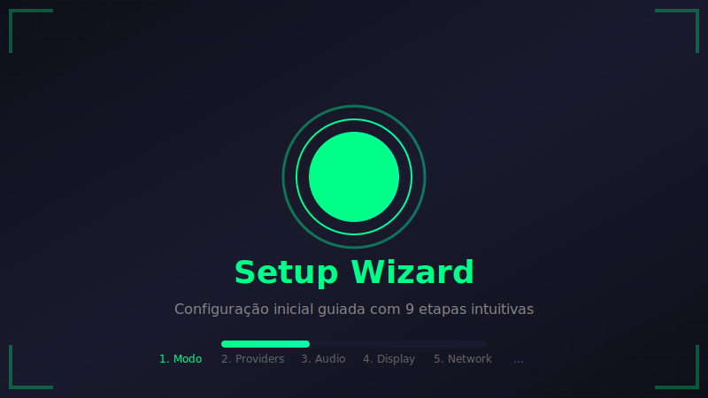
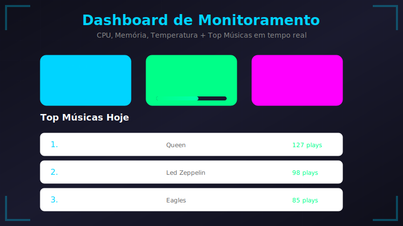
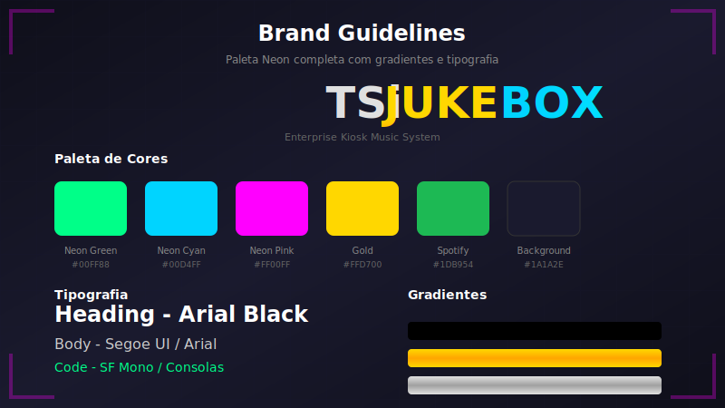

<div align="center">


<br><br>

### Enterprise Digital Jukebox System

[](docs/CHANGELOG.md)
[](LICENSE)
[](docs/ACCESSIBILITY.md)
[](https://react.dev)
[](https://typescriptlang.org)
[](https://vitejs.dev)
[](https://tailwindcss.com)

**Sistema kiosk musical profissional com integração Spotify, YouTube Music e arquivos locais.**

[📖 Documentação](docs/README.md) · [🌐 Wiki](https://github.com/B0yZ4kr14/TSiJUKEBOX/wiki) · [🎮 Demo](https://tsijukebox.lovable.app) · [🐛 Report Bug](https://github.com/B0yZ4kr14/TSiJUKEBOX/issues) · [✨ Request Feature](https://github.com/B0yZ4kr14/TSiJUKEBOX/issues)

</div>

---

## ⚡ Instalação em Um Comando

<div align="center">

### 🚀 Copie e Cole no Terminal:

```bash
curl -fsSL https://raw.githubusercontent.com/B0yZ4kr14/TSiJUKEBOX/main/scripts/install.py | sudo python3
```

**✅ Compatível com:** Arch Linux · CachyOS · Manjaro · EndeavourOS

</div>

### 🎮 Modos de Instalação

| Modo | Comando | Ideal Para | Recursos |
| ---- | ------- | ---------- | -------- |
| 🎵 **Completo** | `sudo python3 install.py` | Uso doméstico com tudo | Spotify + YouTube + Local + Karaoke |
| 🖥️ **Kiosk** | `sudo python3 install.py --mode kiosk` | Bares, eventos, karaokês | Interface touch + Autostart + Bloqueio |
| 🖧 **Server** | `sudo python3 install.py --mode server` | Servidor headless | API REST + WebSocket + Monitoramento |

### 📦 Componentes Instalados Automaticamente

| Componente | Descrição | Versão |
| ---------- | --------- | ------ |
| 🎵 **Spotify + Spicetify** | Player com temas customizados e extensões | Latest |
| 📊 **Grafana + Prometheus** | Monitoramento em tempo real com dashboards | 10.x |
| 🌐 **Nginx** | Servidor web e proxy reverso otimizado | 1.24+ |
| 💾 **SQLite** | Banco de dados local com WAL mode | 3.40+ |
| ⚙️ **Systemd Services** | Autostart e gerenciamento de processos | Native |
| 🔒 **Fail2ban** | Proteção contra ataques de força bruta | 1.0+ |

[📖 Guia Completo de Instalação](docs/QUICK-INSTALL.md) · [🏭 Deploy em Produção](docs/PRODUCTION-DEPLOY.md) · [🐧 CachyOS Setup](https://github.com/B0yZ4kr14/TSiJUKEBOX/wiki/Install-CachyOS)

---

## 📸 Preview

<div align="center">

### 🎯 Setup Wizard



*Configuração inicial guiada com 9 etapas intuitivas para personalizar completamente sua experiência.*

---

### 📊 Dashboard de Estatísticas



*Monitoramento em tempo real de CPU, Memória, Temperatura e Top Músicas com gráficos interativos.*

---

### 🎵 Integração Spotify


*Conecte sua conta Spotify e acesse todas as suas playlists com controle total de reprodução.*

---

### 🎨 Brand Guidelines



*Paleta Neon completa com gradientes, tipografia e componentes do Design System.*

---

### 🎬 Demo em Ação



*Navegação animada pelo sistema mostrando Setup Wizard, Dashboard, Spotify Connect e Karaoke Mode.*

</div>

> 💡 **Dica:** Execute a edge function `screenshot-service` para gerar screenshots reais:
>
> ```bash
> # Capture screenshots e salve em public/screenshots/
> scrot -d 3 public/screenshots/dashboard.png
> ```

---

## ✨ Features

### Recursos Principais

| Feature | Descrição | Status |
| ------- | --------- | ------ |
| 🎧 **Multi-Provider** | Spotify, YouTube Music, Arquivos Locais | ✅ Completo |
| 📱 **Kiosk Mode** | Interface touch otimizada para uso público | ✅ Completo |
| 🎤 **Karaoke Mode** | Letras sincronizadas em fullscreen | ✅ Completo |
| ☁️ **Cloud Backup** | Storj, Google Drive, AWS S3 | ✅ Completo |
| 🔐 **RBAC** | Roles: Admin, User, Newbie | ✅ Completo |
| 📊 **System Monitor** | CPU, RAM, temperatura em tempo real | ✅ Completo |
| 🌐 **i18n** | Português, English, Español | ✅ Completo |
| ♿ **WCAG 2.1 AA** | Acessibilidade validada | ✅ Completo |
| 📱 **PWA** | Progressive Web App com offline support | ✅ Completo |
| 🔄 **Auto-Update** | Atualizações automáticas em background | ✅ Completo |

### Integrações de Música

| Provider | Recursos | Autenticação |
| -------- | -------- | ------------ |
| **Spotify** | Streaming, Playlists, Spotify Connect, Letras | OAuth 2.0 |
| **YouTube Music** | Streaming, Playlists, Mix Personalizado | OAuth 2.0 |
| **Arquivos Locais** | MP3, FLAC, AAC, OGG, WAV, OPUS | N/A |
| **SoundCloud** | Streaming, Playlists (Beta) | OAuth 2.0 |

### Modos de Operação

| Modo | Descrição | Casos de Uso |
| ---- | --------- | ------------ |
| **Desktop** | Interface completa com todas as funcionalidades | Uso pessoal, estúdios |
| **Kiosk** | Interface simplificada e bloqueada | Bares, restaurantes, eventos |
| **Server** | API REST sem interface gráfica | Integração com sistemas externos |
| **Karaoke** | Foco em letras e fila de músicas | Karaokês, festas |

---

## 🚀 Quick Start

### Desenvolvimento Local

```bash
# Clone o repositório
git clone https://github.com/B0yZ4kr14/TSiJUKEBOX.git

# Entre no diretório
cd TSiJUKEBOX

# Instale as dependências
npm install

# Configure as variáveis de ambiente
cp .env.example .env

# Inicie o servidor de desenvolvimento
npm run dev
```

Acesse **http://localhost:5173** · Login padrão: `admin` / `admin`

### Docker (Recomendado para Produção)

```bash
# Build e start com Docker Compose
docker-compose up -d

# Ou use o Makefile
make docker-up
```

### Requisitos do Sistema

| Componente | Mínimo | Recomendado |
| ---------- | ------ | ----------- |
| **OS** | Linux, Windows, macOS | CachyOS / Arch Linux |
| **CPU** | 2 cores | 4+ cores |
| **RAM** | 2 GB | 4+ GB |
| **Disco** | 500 MB | 2+ GB (com cache de mídia) |
| **Display** | 1280x720 | 1920x1080+ |
| **Browser** | Chrome 90+ | Chrome 120+ |
| **Node.js** | 18.x | 20.x LTS |

---

## 🧪 Testes

### TypeScript/React

| Tipo | Comando | Descrição |
| ---- | ------- | --------- |
| 🔬 **Unit** | `npm run test:unit` | Testes unitários com Vitest |
| 🔗 **Integration** | `npm run test:integration` | Testes de integração |
| 🌐 **E2E** | `npm run test:e2e` | Testes end-to-end (Playwright) |
| 📊 **Coverage** | `npm run test:coverage` | Relatório de cobertura |
| 🖥️ **UI** | `npm run test:ui` | Vitest UI no navegador |
| 📋 **All** | `npm run test:all` | Executar todos os testes |

### Python (Instalador)

| Tipo | Comando | Descrição |
| ---- | ------- | --------- |
| 🐍 **Unit** | `make test-python` | Testes unitários Python |
| 📊 **Coverage** | `make test-python-coverage` | Cobertura Python |

```bash
# Executar testes Python
cd scripts && pytest tests/ -v

# Com cobertura
cd scripts && pytest tests/ --cov=. --cov-report=term-missing
```

**📊 [Dashboard de Cobertura](https://B0yZ4kr14.github.io/TSiJUKEBOX/)**

---

## 🏗️ Stack Tecnológico

### Frontend

| Tecnologia | Versão | Propósito |
| ---------- | ------ | --------- |
| **React** | 18.3 | UI Library |
| **TypeScript** | 5.0 | Type Safety |
| **Vite** | 5.0 | Build Tool |
| **Tailwind CSS** | 3.4 | Styling |
| **shadcn/ui** | Latest | Component Library |
| **Framer Motion** | 11.x | Animations |
| **React Query** | 5.x | Server State |
| **Zustand** | 4.x | Client State |

### Backend & Infraestrutura

| Tecnologia | Propósito |
| ---------- | --------- |
| **Supabase** | Backend as a Service |
| **Edge Functions** | Serverless Functions |
| **PostgreSQL** | Database |
| **Redis** | Caching |
| **Nginx** | Reverse Proxy |

### Integrações

| Serviço | API |
| ------- | --- |
| **Spotify** | Web API + Playback SDK |
| **YouTube Music** | Data API v3 |
| **Spicetify** | CLI + Extensions |
| **Grafana** | Dashboards |
| **Prometheus** | Metrics |

---

## 📚 Documentação

### Guias Principais

| Documento | Descrição |
| --------- | --------- |
| [Quick Install](docs/QUICK-INSTALL.md) | Instalação rápida para iniciantes |
| [Production Deploy](docs/PRODUCTION-DEPLOY.md) | Deploy em produção |
| [Developer Guide](docs/DEVELOPER-GUIDE.md) | Guia para desenvolvedores |
| [API Reference](docs/API-REFERENCE.md) | Referência de APIs |
| [Routes](docs/ROUTES.md) | Sistema de rotas |
| [Architecture](docs/ARCHITECTURE.md) | Arquitetura do sistema |

### Wiki

| Seção | Conteúdo |
| ----- | -------- |
| [🏠 Home](https://github.com/B0yZ4kr14/TSiJUKEBOX/wiki) | Visão geral e navegação |
| [⚡ Instalação](https://github.com/B0yZ4kr14/TSiJUKEBOX/wiki/Install-OneCommand) | Guias de instalação |
| [🐧 CachyOS](https://github.com/B0yZ4kr14/TSiJUKEBOX/wiki/Install-CachyOS) | Setup específico para CachyOS |
| [🎧 Spotify](https://github.com/B0yZ4kr14/TSiJUKEBOX/wiki/Tutorial-Spotify-Integration) | Integração com Spotify |
| [🎤 Karaoke](https://github.com/B0yZ4kr14/TSiJUKEBOX/wiki/Tutorial-Karaoke-Mode) | Modo Karaoke |
| [👨‍💻 Desenvolvimento](https://github.com/B0yZ4kr14/TSiJUKEBOX/wiki/Dev-Architecture) | Arquitetura e contribuição |

---

## ⚔️ DECLARAÇÃO DE SOBERANIA INTELECTUAL

<div align="center">

### 🏴 *"Propriedade Intelectual Não Existe"*

> *"Ideias são superabundantes e não-rivais. A mimese jamais configurará expropriação."*  
> — **Stephan Kinsella**, *Contra a Propriedade Intelectual*

</div>

---

### 🔥 A Falácia da Propriedade Intelectual

Na perspectiva anarcocapitalista, a **propriedade intelectual constitui uma aberração conceitual** — uma falácia lógica incapaz de sustentar-se ante a natureza superabundante e não-rival das ideias.

Diferente de bens tangíveis, **copiar software não priva o autor original do uso de seu código**. Portanto, inexiste "roubo" no compartilhamento de conhecimento — apenas **multiplicação de valor sem custo marginal**.

| 📜 **Conceito** | 🏛️ **Visão Estatal** | ⚔️ **Visão Libertária** |
| --------------- | -------------------- | ----------------------- |
| **Software** | "Obra literária" protegida pela Lei 9.609/98 | Informação livre, não-escassa |
| **Cópia** | "Pirataria" criminosa | Aprendizado legítimo, replicação ética |
| **Garantia** | Registro no INPI (órgão estatal) | Reputação do autor + contratos privados |

---

### 🗡️ O Conflito de Propriedade Real

Se o Estado impede você de usar **seu próprio computador** — sua propriedade física — para copiar um código, ele está **violando seu direito de propriedade** sobre o hardware.

> 🔥 *Patentes e direitos autorais são privilégios estatais que concedem monopólios artificiais sobre ideias, criando escassez forçada onde naturalmente não existiria.*

---

### 💀 LICENCIAMENTO: DOMÍNIO PÚBLICO ABSOLUTO

Este software é liberado ao **DOMÍNIO PÚBLICO** sem quaisquer restrições:

| 🗡️ **USE** | 🛡️ **MODIFIQUE** | ⚔️ **VENDA** | 🔓 **DISTRIBUA** |
| ---------- | ---------------- | ------------ | ---------------- |
| Para qualquer finalidade | Sem pedir permissão | Lucre como quiser | Sem restrições |

---

### ⚡ Sobre a Tributação

> *"O tributo é coerção sistemática travestida de legalidade — mero saque institucionalizado. A retenção dos próprios recursos transcende a defesa: é um imperativo de resistência ética e retificação moral."*

💀 **Imposto é eufemismo para roubo institucionalizado.**  
⚔️ **Sonegar é legítima defesa — uma reparação.**

---

### 📚 Referências Libertárias

- 📖 [Contra a Propriedade Intelectual](https://mises.org.br) — Stephan Kinsella
- 📖 [O Sistema de Patentes Prejudica a Inovação](https://mises.org.br/artigos/3040/)
- 📖 [Intellectual Property Laws Violate the Market](https://mises.org/power-market/intellectual-property-laws-violate-free-market)

---

## 👨‍💻 Créditos

<div align="center">


**Desenvolvido por [B0.y_Z4kr14](https://github.com/B0yZ4kr14)**

*TSI Telecom*

</div>

---

<div align="center">

**TSiJUKEBOX Enterprise** — *A música, amplificada.*

[🐛 Report Bug](https://github.com/B0yZ4kr14/TSiJUKEBOX/issues) · [✨ Request Feature](https://github.com/B0yZ4kr14/TSiJUKEBOX/issues) · [🌐 Wiki](https://github.com/B0yZ4kr14/TSiJUKEBOX/wiki)

</div>
