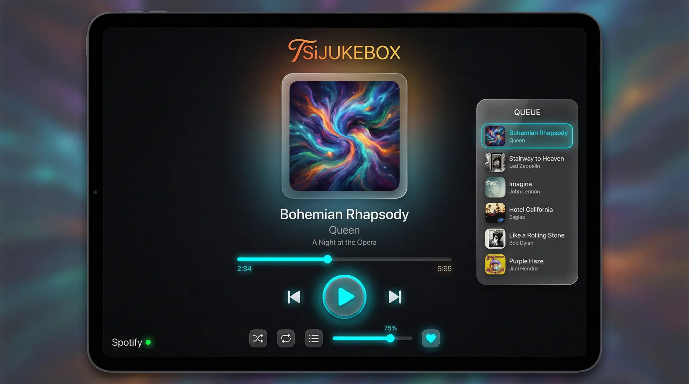
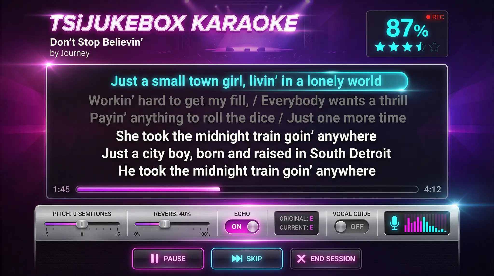
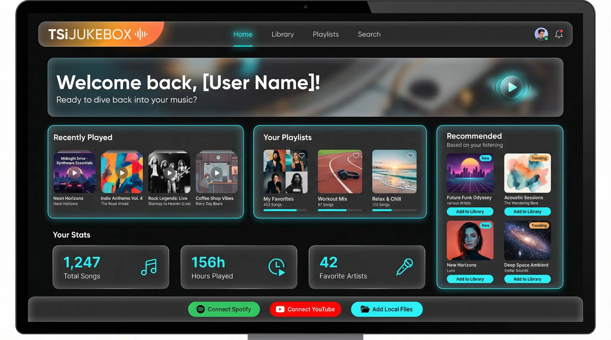
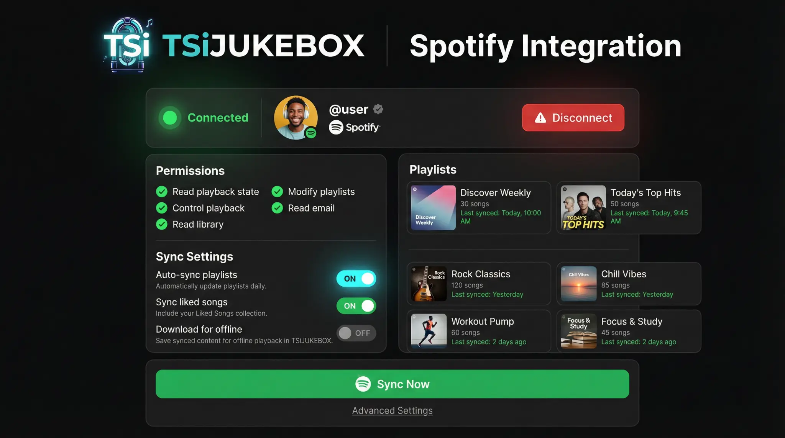
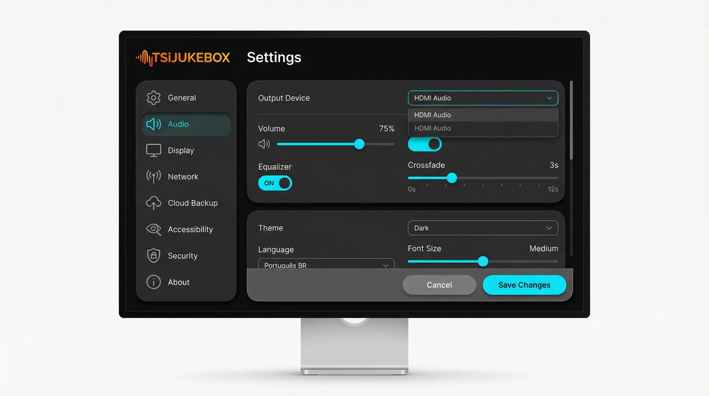

<div align="center">


<br><br>

# 🎵 TSiJUKEBOX

### Enterprise Digital Jukebox System

[](docs/CHANGELOG.md)
[](LICENSE)
[](docs/ACCESSIBILITY_REPORT_FINAL.md)
[](https://cachyos.org)

[](https://react.dev)
[](https://typescriptlang.org)
[](https://python.org)
[](https://docker.com)

**Sistema kiosk musical profissional com integração Spotify, YouTube Music e arquivos locais.**

[📖 Wiki](https://github.com/B0yZ4kr14/tsijukebox/wiki) · [🌐 Demo](https://tsijukebox.vercel.app) · [🐛 Issues](https://github.com/B0yZ4kr14/tsijukebox/issues) · [🎨 Temas](docs/mockups/index.html)

</div>

---

## ⚡ Instalação Rápida — CachyOS / Arch Linux

<div align="center">

### 🐧 Wizard Interativo (Recomendado):

```fish
curl -fsSL https://raw.githubusercontent.com/B0yZ4kr14/tsijukebox/main/scripts/installation-wizard.py | python3
```

### 🚀 Instalação Direta:

```fish
curl -fsSL https://raw.githubusercontent.com/B0yZ4kr14/tsijukebox/main/scripts/unified-installer.py | sudo python3
```

**✅ Otimizado para:** CachyOS · Arch Linux · Manjaro · EndeavourOS

</div>

### 🎮 Modos de Instalação

| Modo | Comando | Acesso | Ideal Para |
|------|---------|--------|------------|
| 🎵 **Full** | `sudo python3 unified-installer.py` | `https://midiaserver.local/jukebox` | Uso doméstico completo |
| 🖥️ **Kiosk** | `sudo python3 unified-installer.py --mode kiosk` | `https://midiaserver.local/jukebox` | Bares, eventos, karaokês |
| 🖧 **Server** | `sudo python3 unified-installer.py --mode server` | `https://midiaserver.local:8080/api` | Servidor headless |

### 📦 Componentes Instalados

| Componente | Descrição | Status |
|------------|-----------|:------:|
| 🐳 **Docker** | Containerização | ✅ |
| 🔥 **UFW** | Firewall | ✅ |
| ⏰ **NTP** | Sincronização de tempo | ✅ |
| 🌐 **Nginx** | Proxy reverso + SSL | ✅ |
| 📊 **Grafana** | Monitoramento visual | ✅ |
| 📈 **Prometheus** | Métricas | ✅ |
| 🛡️ **Fail2ban** | Proteção contra ataques | ✅ |
| 📡 **Avahi/mDNS** | Acesso via `.local` | ✅ |
| 🎵 **Spotify** | Player integrado | ✅ |
| 🎨 **Spicetify** | Customização Spotify | ✅ |

**🔐 Login padrão:** `admin` / `admin`

---

## 🎨 Design System — 6 Temas Visuais

O TSiJUKEBOX oferece **6 temas profissionais** com design neon metallic:

<table>
<tr>
<td align="center" width="33%">

### 🌌 Cosmic Player
`Tema Padrão`



  

</td>
<td align="center" width="33%">

### 🎤 Karaoke Stage
`Modo Karaoke`



  

</td>
<td align="center" width="33%">

### ✨ Stage Neon Metallic
`Novo`

  

**Variáveis CSS:**
```css
--accent-cyan: #00ffff;
--accent-magenta: #ff00d4;
--metallic-chrome: #e8e8e8;
```

</td>
</tr>
<tr>
<td align="center">

### 🏠 Dashboard Home
`Dourado`



 

</td>
<td align="center">

### 🎵 Spotify Integration
`Verde Spotify`



 

</td>
<td align="center">

### ⚙️ Settings Dark
`Roxo`



 

</td>
</tr>
</table>

**📄 Ver todos os mockups:** [docs/mockups/index.html](docs/mockups/index.html)

---

## ✨ Features Principais

<table>
<tr>
<td align="center" width="25%">

### 🎤
**Karaoke Pro**

Letras sincronizadas
Controle de pitch
Reverb & Echo
Pontuação em tempo real

</td>
<td align="center" width="25%">

### 🎵
**Player Avançado**

Visualizador de áudio
Equalização 10 bandas
Playlists inteligentes
Fila dinâmica drag-n-drop

</td>
<td align="center" width="25%">

### 📺
**Modo Kiosk**

Interface fullscreen
Suporte a touch
Autoplay contínuo
Otimizado para TVs

</td>
<td align="center" width="25%">

### 🔗
**Integrações**

Spotify Web API
YouTube Music
GitHub Sync
Cloud Backup (Storj/S3)

</td>
</tr>
</table>

### 🎵 Provedores de Música

| Provider | Recursos | Autenticação |
|----------|----------|--------------|
| 🎵 **Spotify** | Streaming, Playlists, Spotify Connect, Letras | OAuth 2.0 |
| 📺 **YouTube Music** | Streaming, Playlists, Mix Personalizado | OAuth 2.0 |
| 📁 **Arquivos Locais** | MP3, FLAC, AAC, OGG, WAV, OPUS | N/A |

---

## 🏗️ Arquitetura

```
┌─────────────────────────────────────────────────────────────────────────────┐
│                           TSiJUKEBOX Architecture                           │
├─────────────────────────────────────────────────────────────────────────────┤
│                                                                             │
│  ┌─────────────────────────────────────────────────────────────────────┐   │
│  │                        FRONTEND (React + Vite)                      │   │
│  │  ┌──────────┐ ┌──────────┐ ┌──────────┐ ┌──────────┐ ┌──────────┐  │   │
│  │  │  Player  │ │  Queue   │ │ Karaoke  │ │ Settings │ │  Kiosk   │  │   │
│  │  └──────────┘ └──────────┘ └──────────┘ └──────────┘ └──────────┘  │   │
│  │                    6 Temas Visuais · WCAG 2.1 AA                    │   │
│  └─────────────────────────────────────────────────────────────────────┘   │
│                                    │                                        │
│  ┌─────────────────────────────────┼───────────────────────────────────┐   │
│  │                         NGINX (Proxy Reverso)                       │   │
│  │              https://midiaserver.local/jukebox                      │   │
│  │                    SSL · Avahi/mDNS · UFW                           │   │
│  └─────────────────────────────────┼───────────────────────────────────┘   │
│                                    │                                        │
│  ┌─────────────────────────────────┼───────────────────────────────────┐   │
│  │                          DOCKER CONTAINERS                          │   │
│  │  ┌──────────┐ ┌──────────┐ ┌──────────┐ ┌──────────┐ ┌──────────┐  │   │
│  │  │ TSiJUKE  │ │ Grafana  │ │Prometheus│ │ Fail2ban │ │   NTP    │  │   │
│  │  │  :8080   │ │  :3000   │ │  :9090   │ │          │ │          │  │   │
│  │  └──────────┘ └──────────┘ └──────────┘ └──────────┘ └──────────┘  │   │
│  └─────────────────────────────────────────────────────────────────────┘   │
│                                                                             │
│  ┌─────────────────────────────────────────────────────────────────────┐   │
│  │                        SUPABASE (Backend)                           │   │
│  │  ┌──────────┐ ┌──────────┐ ┌──────────┐ ┌──────────┐               │   │
│  │  │PostgreSQL│ │   Auth   │ │ Storage  │ │Edge Funcs│               │   │
│  │  └──────────┘ └──────────┘ └──────────┘ └──────────┘               │   │
│  └─────────────────────────────────────────────────────────────────────┘   │
│                                                                             │
└─────────────────────────────────────────────────────────────────────────────┘
```

### 📁 Estrutura de Pastas

```
tsijukebox/
├── 📁 src/
│   ├── 📁 components/     # 72 Componentes React
│   │   ├── 📁 ui/         # shadcn/ui base
│   │   ├── 📁 player/     # Player de música
│   │   ├── 📁 karaoke/    # Sistema de karaoke
│   │   └── 📁 settings/   # Configurações
│   ├── 📁 pages/          # 45 Páginas
│   ├── 📁 hooks/          # React hooks customizados
│   ├── 📁 stores/         # Estado global (Zustand)
│   └── 📁 themes/         # 6 Temas visuais
├── 📁 scripts/            # 26 Scripts Python
│   ├── unified-installer.py      # Instalador principal
│   ├── installation-wizard.py    # Wizard interativo
│   └── master-fix.py             # Correções automáticas
├── 📁 docs/               # Documentação completa
│   ├── 📁 mockups/        # Mockups HTML dos temas
│   └── 📁 assets/         # Imagens e ícones
└── 📁 wiki/               # Páginas Wiki preparadas
```

---

## 📋 Requisitos do Sistema

| Componente | Mínimo | Recomendado |
|------------|:------:|:-----------:|
| 🐧 **OS** | Arch Linux | CachyOS + Openbox |
| 🐚 **Shell** | bash | fish |
| ⚙️ **CPU** | 2 cores | 4+ cores |
| 💾 **RAM** | 2 GB | 4+ GB |
| 💿 **Disco** | 500 MB | 2+ GB |
| 🐍 **Python** | 3.9 | 3.11+ |
| 🐳 **Docker** | 20.x | 24.x |

---

## 🛠️ Scripts Disponíveis

```fish
# Instalação
python3 scripts/installation-wizard.py    # Wizard interativo
sudo python3 scripts/unified-installer.py # Instalação direta

# Desenvolvimento
pnpm dev              # Servidor de desenvolvimento
pnpm build            # Build de produção
pnpm preview          # Preview do build

# Qualidade
pnpm lint             # Verifica código
pnpm type-check       # Verifica tipos TypeScript

# Testes
pnpm test             # Testes unitários (Vitest)
pnpm test:e2e         # Testes E2E (Playwright)
pnpm test:coverage    # Relatório de cobertura

# Utilitários
python3 scripts/master-fix.py --all    # Correções automáticas
```

---

## ♿ Acessibilidade WCAG 2.1 AA

| Recurso | Implementação | Status |
|---------|---------------|:------:|
| ⌨️ Navegação por Teclado | Tab, Enter, Escape | ✅ |
| 🔊 Leitores de Tela | ARIA labels e roles | ✅ |
| 🎨 Contraste de Cores | Ratio mínimo 4.5:1 | ✅ |
| 🎯 Foco Visível | Indicador claro | ✅ |

**Métricas:** 238 aria-labels · 550 aria-hidden · 50 roles · [📄 Relatório Completo](docs/ACCESSIBILITY_REPORT_FINAL.md)

---

## 📚 Documentação

| Documento | Descrição |
|-----------|-----------|
| 📖 [Wiki](https://github.com/B0yZ4kr14/tsijukebox/wiki) | Documentação completa |
| 📥 [Instalação](https://github.com/B0yZ4kr14/tsijukebox/wiki/Installation-Guide) | Guia passo a passo |
| ⚙️ [Configuração](https://github.com/B0yZ4kr14/tsijukebox/wiki/Configuration) | Opções avançadas |
| 🎨 [Design System](https://github.com/B0yZ4kr14/tsijukebox/wiki/Design-System) | Tokens e cores |
| 🔌 [API Reference](https://github.com/B0yZ4kr14/tsijukebox/wiki/API-Reference) | Endpoints REST |
| ♿ [Acessibilidade](docs/ACCESSIBILITY_REPORT_FINAL.md) | Relatório WCAG 2.1 AA |
| 🎨 [Mockups](docs/mockups/index.html) | Temas visuais |

---

## 🤝 Contribuindo

1. 🍴 **Fork** → `gh repo fork B0yZ4kr14/tsijukebox`
2. 🌿 **Branch** → `git checkout -b feature/AmazingFeature`
3. 💾 **Commit** → `git commit -m 'feat: add AmazingFeature'`
4. 📤 **Push** → `git push origin feature/AmazingFeature`
5. 🔀 **PR** → `gh pr create`

---

## 📜 Licença e Filosofia

<div align="center">

### ⚔️ DECLARAÇÃO DE SOBERANIA INTELECTUAL


</div>

---

### 🏴 "Propriedade Intelectual Não Existe"

> *"Ideias são superabundantes e não-rivais. A mimese jamais configurará expropriação."*
>
> — **Stephan Kinsella**, Contra a Propriedade Intelectual

---

### 🔥 A Falácia da Propriedade Intelectual

Na perspectiva TecnoLibertária, a **propriedade intelectual** constitui uma **aberração conceitual** — uma falácia lógica incapaz de sustentar-se ante a natureza **superabundante** e **não-rival** das ideias.

Diferente de bens tangíveis, **copiar software não priva o autor original** do uso de seu código. Portanto, inexiste "roubo" no compartilhamento de conhecimento — apenas **multiplicação de valor sem custo marginal**.

| 📜 Conceito | 🏛️ Visão Estatal | ⚔️ Visão Libertária |
|------------|-----------------|-------------------|
| **Software** | "Obra literária" protegida pela Lei 9.609/98 | Informação livre, não-escassa |
| **Cópia** | "Pirataria" criminosa | Aprendizado legítimo, replicação ética |
| **Garantia** | Registro no INPI (órgão estatal) | Reputação do autor + contratos privados |

---

### 💀 LICENCIAMENTO: DOMÍNIO PÚBLICO ABSOLUTO

<div align="center">


**🐍 DON'T TREAD ON ME 🐍**

</div>

Este software é liberado ao **DOMÍNIO PÚBLICO** sem quaisquer restrições:

| 🗡️ USE | 🛡️ MODIFIQUE | ⚔️ VENDA | 🔓 DISTRIBUA |
|--------|-------------|---------|-------------|
| Para qualquer finalidade | Sem pedir permissão | Lucre como quiser | Sem restrições |

---

## 👨‍💻 Créditos

<div align="center">


### **B0.y_Z4kr14**

⚔️ Desenvolvedor Libertário · 🏴 TecnoLibertária · 🐍 Don't Tread On Me

[](https://github.com/B0yZ4kr14)
[](docs/DONATIONS.md)
[](docs/DONATIONS.md)

</div>

---

## 🌟 Agradecimentos

- 🎵 **Spotify** — API e SDK de reprodução
- 📺 **YouTube** — Data API v3
- 🎨 **shadcn/ui** — Component library
- ⚡ **Supabase** — Backend as a Service
- 🐧 **Arch Linux / CachyOS** — Base sólida e filosofia KISS
- 🤖 **Manus AI** — Assistente de desenvolvimento

---

<div align="center">

### 🏴 Desenvolvido com ❤️ e Liberdade

**TSiJUKEBOX** © 2025 B0.y_Z4kr14 · Domínio Público Absoluto

🐍 **Don't Tread On Me** 🐍

[](https://github.com/B0yZ4kr14/tsijukebox)
[](https://github.com/B0yZ4kr14/tsijukebox/fork)
[](https://github.com/B0yZ4kr14/tsijukebox)

</div>
