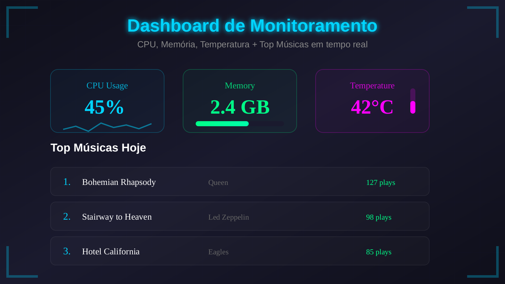
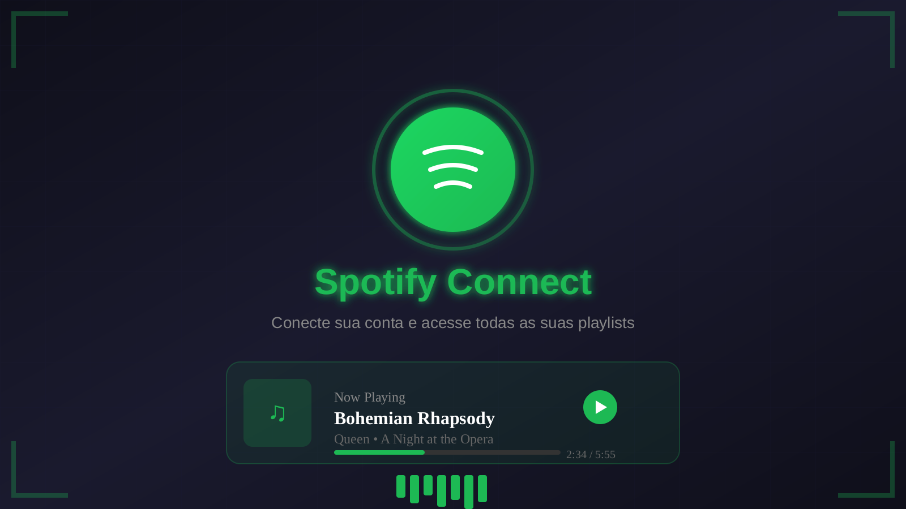
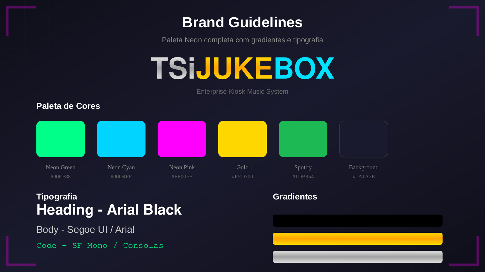
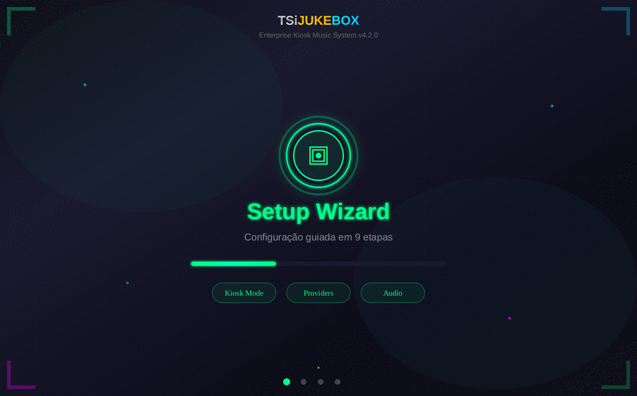

<div align="center">


<br><br>

# 🎵 TSiJUKEBOX
### Enterprise Digital Jukebox System

[](docs/CHANGELOG.md)
[](LICENSE)
[](docs/ACCESSIBILITY.md)
[](https://react.dev)
[](https://typescriptlang.org)
[](https://vitejs.dev)
[](https://tailwindcss.com)

**Sistema kiosk musical profissional com integração Spotify, YouTube Music e arquivos locais.**

[📖 Documentação](docs/WIKI.md) · [🌐 Wiki](https://github.com/B0yZ4kr14/TSiJUKEBOX/wiki) · [🎮 Demo](https://tsijukebox.lovable.app) · [🐛 Report Bug](https://github.com/B0yZ4kr14/TSiJUKEBOX/issues) · [✨ Request Feature](https://github.com/B0yZ4kr14/TSiJUKEBOX/issues)

</div>

---

## ⚡ Instalação em Um Comando

<div align="center">

### 🚀 Copie e Cole no Terminal:

```bash
curl -fsSL https://raw.githubusercontent.com/B0yZ4kr14/TSiJUKEBOX/main/scripts/install.py | sudo python3
```

**✅ Compatível com:** Arch Linux · CachyOS · Manjaro · EndeavourOS

</div>

### 🎮 Modos de Instalação

| Modo | Comando | Ideal Para | Recursos |
| ---- | ------- | ---------- | -------- |
| 🎵 **Completo** | `sudo python3 install.py` | Uso doméstico com tudo | Spotify + YouTube + Local + Karaoke |
| 🖥️ **Kiosk** | `sudo python3 install.py --mode kiosk` | Bares, eventos, karaokês | Interface touch + Autostart + Bloqueio |
| 🖧 **Server** | `sudo python3 install.py --mode server` | Servidor headless | API REST + WebSocket + Monitoramento |

### 📦 Componentes Instalados Automaticamente

| Componente | Descrição | Versão |
| ---------- | --------- | ------ |
| 🎵 **Spotify + Spicetify** | Player com temas customizados e extensões | Latest |
| 📊 **Grafana + Prometheus** | Monitoramento em tempo real com dashboards | 10.x |
| 🌐 **Nginx** | Servidor web e proxy reverso otimizado | 1.24+ |
| 💾 **SQLite** | Banco de dados local com WAL mode | 3.40+ |
| ⚙️ **Systemd Services** | Autostart e gerenciamento de processos | Native |
| 🔒 **Fail2ban** | Proteção contra ataques de força bruta | 1.0+ |

[📖 Guia Completo de Instalação](docs/QUICK-INSTALL.md) · [🏭 Deploy em Produção](docs/PRODUCTION-DEPLOY.md) · [🐧 CachyOS Setup](https://github.com/B0yZ4kr14/TSiJUKEBOX/wiki/Install-CachyOS)

---

## 📸 Preview

<div align="center">

### 🎯 Setup Wizard


*Configuração inicial guiada com 9 etapas intuitivas para personalizar completamente sua experiência.*

---

### 📊 Dashboard de Estatísticas



*Monitoramento em tempo real de CPU, Memória, Temperatura e Top Músicas com gráficos interativos.*

---

### 🎵 Integração Spotify



*Conecte sua conta Spotify e acesse todas as suas playlists com controle total de reprodução.*

---

### 🎨 Brand Guidelines



*Paleta Neon completa com gradientes, tipografia e componentes do Design System.*

---

### 🎬 Demo em Ação



*Navegação animada pelo sistema mostrando Setup Wizard, Dashboard, Spotify Connect e Karaoke Mode.*

---

### 🎵 Player Interface


*Interface principal do player com controles completos, visualização de álbum e fila de reprodução.*

</div>

> 💡 **Dica:** Execute a edge function `screenshot-service` para gerar screenshots reais:
>
> ```bash
> # Capture screenshots e salve em public/screenshots/
> scrot -d 3 public/screenshots/dashboard.png
> ```

---

## 🎨 Seções da Documentação

<div align="center">

<table>
  <tr>
    <td align="center" width="25%">
      
      <br/><strong>Instalação</strong>
      <br/><sub>Verde Neon</sub>
    </td>
    <td align="center" width="25%">
      
      <br/><strong>Configuração</strong>
      <br/><sub>Cyan</sub>
    </td>
    <td align="center" width="25%">
      
      <br/><strong>Tutoriais</strong>
      <br/><sub>Magenta</sub>
    </td>
    <td align="center" width="25%">
      
      <br/><strong>Desenvolvimento</strong>
      <br/><sub>Amarelo Ouro</sub>
    </td>
  </tr>
  <tr>
    <td align="center" width="25%">
      
      <br/><strong>API</strong>
      <br/><sub>Roxo</sub>
    </td>
    <td align="center" width="25%">
      
      <br/><strong>Segurança</strong>
      <br/><sub>Laranja</sub>
    </td>
    <td align="center" width="25%">
      
      <br/><strong>Monitoramento</strong>
      <br/><sub>Verde Lima</sub>
    </td>
    <td align="center" width="25%">
      
      <br/><strong>Testes</strong>
      <br/><sub>Azul Elétrico</sub>
    </td>
  </tr>
</table>

[📖 Ver Documentação Completa dos Ícones](docs/assets/icons/README.md)

</div>

---

## ✨ Features

### 🎯 Recursos Principais

| Feature | Descrição | Status |
| ------- | --------- | ------ |
| 🎧 **Multi-Provider** | Spotify, YouTube Music, Arquivos Locais | ✅ Completo |
| 📱 **Kiosk Mode** | Interface touch otimizada para uso público | ✅ Completo |
| 🎤 **Karaoke Mode** | Letras sincronizadas em fullscreen | ✅ Completo |
| ☁️ **Cloud Backup** | Storj, Google Drive, AWS S3 | ✅ Completo |
| 🔐 **RBAC** | Roles: Admin, User, Newbie | ✅ Completo |
| 📊 **System Monitor** | CPU, RAM, temperatura em tempo real | ✅ Completo |
| 🌐 **i18n** | Português, English, Español | ✅ Completo |
| ♿ **WCAG 2.1 AA** | Acessibilidade validada | ✅ Completo |
| 📱 **PWA** | Progressive Web App com offline support | ✅ Completo |
| 🔄 **Auto-Update** | Atualizações automáticas em background | ✅ Completo |

### 🎵 Integrações de Música

| Provider | Recursos | Autenticação |
| -------- | -------- | ------------ |
| 🎵 **Spotify** | Streaming, Playlists, Spotify Connect, Letras | OAuth 2.0 |
| 📺 **YouTube Music** | Streaming, Playlists, Mix Personalizado | OAuth 2.0 |
| 📁 **Arquivos Locais** | MP3, FLAC, AAC, OGG, WAV, OPUS | N/A |
| ☁️ **SoundCloud** | Streaming, Playlists (Beta) | OAuth 2.0 |

### 🎮 Modos de Operação

| Modo | Descrição | Casos de Uso |
| ---- | --------- | ------------ |
| 🖥️ **Desktop** | Interface completa com todas as funcionalidades | Uso pessoal, estúdios |
| 🏪 **Kiosk** | Interface simplificada e bloqueada | Bares, restaurantes, eventos |
| 🖧 **Server** | API REST sem interface gráfica | Integração com sistemas externos |
| 🎤 **Karaoke** | Foco em letras e fila de músicas | Karaokês, festas |

---

## 🚀 Quick Start

### 💻 Desenvolvimento Local

```bash
# Clone o repositório
git clone https://github.com/B0yZ4kr14/TSiJUKEBOX.git

# Entre no diretório
cd TSiJUKEBOX

# Instale as dependências
npm install

# Configure as variáveis de ambiente
cp .env.example .env

# Inicie o servidor de desenvolvimento
npm run dev
```

Acesse **http://localhost:5173** · Login padrão: `admin` / `admin`

### 🐳 Docker (Recomendado para Produção)

```bash
# Build e start com Docker Compose
docker-compose up -d

# Ou use o Makefile
make docker-up
```

### 📋 Requisitos do Sistema

| Componente | Mínimo | Recomendado |
| ---------- | ------ | ----------- |
| 🖥️ **OS** | Linux, Windows, macOS | CachyOS / Arch Linux |
| ⚙️ **CPU** | 2 cores | 4+ cores |
| 💾 **RAM** | 2 GB | 4+ GB |
| 💿 **Disco** | 500 MB | 2+ GB (com cache de mídia) |
| 🖥️ **Display** | 1280x720 | 1920x1080+ |
| 🌐 **Browser** | Chrome 90+ | Chrome 120+ |
| 🟢 **Node.js** | 18.x | 20.x LTS |

---

## 🧪 Testes

### TypeScript/React

| Tipo | Comando | Descrição |
| ---- | ------- | --------- |
| 🔬 **Unit** | `npm run test:unit` | Testes unitários com Vitest |
| 🔗 **Integration** | `npm run test:integration` | Testes de integração |
| 🌐 **E2E** | `npm run test:e2e` | Testes end-to-end (Playwright) |
| 📊 **Coverage** | `npm run test:coverage` | Relatório de cobertura |
| 🖥️ **UI** | `npm run test:ui` | Vitest UI no navegador |
| 📋 **All** | `npm run test:all` | Executar todos os testes |

### Python (Instalador)

| Tipo | Comando | Descrição |
| ---- | ------- | --------- |
| 🐍 **Unit** | `make test-python` | Testes unitários Python |
| 📊 **Coverage** | `make test-python-coverage` | Cobertura Python |

```bash
# Executar testes Python
cd scripts && pytest tests/ -v

# Com cobertura
cd scripts && pytest tests/ --cov=. --cov-report=term-missing
```

**📊 [Dashboard de Cobertura](https://B0yZ4kr14.github.io/TSiJUKEBOX/)**

---

## 🏗️ Stack Tecnológico

### 🎨 Frontend

| Tecnologia | Versão | Propósito |
| ---------- | ------ | --------- |
| ⚛️ **React** | 18.3 | UI Library |
| 📘 **TypeScript** | 5.0 | Type Safety |
| ⚡ **Vite** | 5.0 | Build Tool |
| 🎨 **Tailwind CSS** | 3.4 | Styling |
| 🧩 **shadcn/ui** | Latest | Component Library |
| 🎬 **Framer Motion** | 11.x | Animations |
| 🔄 **React Query** | 5.x | Server State |
| 🗄️ **Zustand** | 4.x | Client State |

### 🖧 Backend & Infraestrutura

| Tecnologia | Propósito |
| ---------- | --------- |
| ⚡ **Supabase** | Backend as a Service |
| 🔥 **Edge Functions** | Serverless Functions |
| 🐘 **PostgreSQL** | Database |
| 🔴 **Redis** | Caching |
| 🌐 **Nginx** | Reverse Proxy |

### 🔌 Integrações

| Serviço | API |
| ------- | --- |
| 🎵 **Spotify** | Web API + Playback SDK |
| 📺 **YouTube Music** | Data API v3 |
| 🎨 **Spicetify** | CLI + Extensions |
| 📊 **Grafana** | Dashboards |
| 📈 **Prometheus** | Metrics |

---

## ❓ FAQ (Perguntas Frequentes)

### 🔧 Instalação e Configuração

**P: Quais sistemas operacionais são suportados?**

R: O TSiJUKEBOX é compatível com Linux (CachyOS, Arch, Manjaro, EndeavourOS recomendados), Windows e macOS. Para melhor experiência, recomendamos CachyOS com Openbox.

**P: Preciso de uma conta Spotify Premium?**

R: Não é obrigatório, mas o Spotify Premium é altamente recomendado para acesso completo a recursos como Spotify Connect e streaming de alta qualidade.

**P: Como altero a senha padrão?**

R: Após o primeiro login com `admin`/`admin`, acesse **Configurações > Segurança > Alterar Senha** e defina uma nova senha.

**P: O instalador funciona em outras distribuições Linux?**

R: O instalador automático é otimizado para Arch Linux e derivados. Para outras distribuições, consulte o [Guia de Instalação Manual](docs/INSTALLATION.md).

---

### 🎵 Uso e Funcionalidades

**P: Como adiciono músicas locais?**

R: Acesse **Configurações > Música Local**, clique em "Adicionar Diretório" e selecione a pasta com seus arquivos de música. O sistema escaneará automaticamente os arquivos compatíveis.

**P: Posso usar o TSiJUKEBOX sem internet?**

R: Sim! O modo offline permite reproduzir músicas locais e acessar playlists previamente sincronizadas. Recursos de streaming (Spotify, YouTube) requerem conexão.

**P: Como ativo o modo Karaoke?**

R: Clique no ícone 🎤 no player ou acesse **Configurações > Modos > Karaoke**. As letras serão exibidas em fullscreen sincronizadas com a música.

**P: O sistema suporta múltiplos usuários?**

R: Sim! O TSiJUKEBOX possui sistema RBAC com 3 níveis: **Admin** (controle total), **User** (uso padrão) e **Newbie** (acesso limitado).

---

### 🛠️ Troubleshooting

**P: O Spotify não conecta. O que fazer?**

R: Verifique se suas credenciais OAuth estão corretas em **Configurações > Integrações > Spotify**. Certifique-se de que a URI de redirecionamento está configurada no Spotify Developer Dashboard.

**P: O sistema está lento. Como otimizar?**

R: Acesse **Configurações > Performance** e ajuste:
- Desabilite animações complexas
- Reduza o cache de álbuns
- Limite o histórico de reprodução
- Ative o modo de baixo consumo

**P: Como faço backup das configurações?**

R: Acesse **Configurações > Backup** e escolha:
- **Manual:** Exportar para arquivo local
- **Automático:** Configurar backup em nuvem (Storj, Google Drive, S3)

**P: Erro ao instalar no CachyOS. O que fazer?**

R: Consulte o [Guia de Instalação CachyOS](https://github.com/B0yZ4kr14/TSiJUKEBOX/wiki/Install-CachyOS) ou abra uma [issue no GitHub](https://github.com/B0yZ4kr14/TSiJUKEBOX/issues).

---

## 📚 Documentação Completa

| Documento | Descrição |
| --------- | --------- |
| 🚀 [Guia de Introdução](docs/guides/GETTING_STARTED.md) | Comece a usar o TSiJUKEBOX rapidamente. |
| 🏗️ [Guia do Desenvolvedor](docs/guides/DEVELOPER_GUIDE.md) | Detalhes da arquitetura e como contribuir. |
| 🏭 [Guia de Deploy](docs/guides/DEPLOYMENT_GUIDE.md) | Implantação em ambientes de produção. |
| 📚 [Wiki Completa](docs/WIKI.md) | Documentação detalhada de todos os recursos. |
| 🎨 [Design System](docs/DESIGN_SYSTEM.md) | Tokens, componentes e padrões visuais. |
| 🔐 [Segurança](docs/SECURITY.md) | Políticas e práticas de segurança. |
| ♿ [Acessibilidade](docs/ACCESSIBILITY.md) | Conformidade com as diretrizes WCAG 2.1 AA. |
| 🔄 [Changelog](docs/CHANGELOG.md) | Histórico completo de versões e alterações. |

---

## 🤝 Contribuindo

Contribuições são bem-vindas! Siga os passos:

1. 🍴 Fork o projeto
2. 🌿 Crie uma branch (`git checkout -b feature/AmazingFeature`)
3. 💾 Commit suas mudanças (`git commit -m 'Add some AmazingFeature'`)
4. 📤 Push para a branch (`git push origin feature/AmazingFeature`)
5. 🔀 Abra um Pull Request

**📋 [Guia de Contribuição](CONTRIBUTING.md)** · **🎨 [Code Style Guide](docs/CODE-STYLE.md)** · **🐛 [Report Bug](https://github.com/B0yZ4kr14/TSiJUKEBOX/issues)**

---

## 📜 Licença e Filosofia

<div align="center">

### ⚔️ DECLARAÇÃO DE SOBERANIA INTELECTUAL


</div>

---

### 🏴 "Propriedade Intelectual Não Existe"

> *"Ideias são superabundantes e não-rivais. A mimese jamais configurará expropriação."*
>
> — **Stephan Kinsella**, Contra a Propriedade Intelectual

---

### 🔥 A Falácia da Propriedade Intelectual

Na perspectiva anarcocapitalista, a **propriedade intelectual** constitui uma **aberração conceitual** — uma falácia lógica incapaz de sustentar-se ante a natureza **superabundante** e **não-rival** das ideias.

Diferente de bens tangíveis, **copiar software não priva o autor original** do uso de seu código. Portanto, inexiste "roubo" no compartilhamento de conhecimento — apenas **multiplicação de valor sem custo marginal**.

| 📜 Conceito | 🏛️ Visão Estatal | ⚔️ Visão Libertária |
|-------------|------------------|---------------------|
| **Software** | "Obra literária" protegida pela Lei 9.609/98 | Informação livre, não-escassa |
| **Cópia** | "Pirataria" criminosa | Aprendizado legítimo, replicação ética |
| **Garantia** | Registro no INPI (órgão estatal) | Reputação do autor + contratos privados |

---

### 🗡️ O Conflito de Propriedade Real

Se o Estado **impede você de usar seu próprio computador** — sua **propriedade física** — para copiar um código, ele está **violando seu direito de propriedade** sobre o hardware.

🔥 **Patentes e direitos autorais são privilégios estatais** que concedem **monopólios artificiais** sobre ideias, criando **escassez forçada** onde naturalmente não existiria.

---

### 💀 LICENCIAMENTO: DOMÍNIO PÚBLICO ABSOLUTO

<div align="center">


**🐍 DON'T TREAD ON ME 🐍**

</div>

Este software é liberado ao **DOMÍNIO PÚBLICO** sem quaisquer restrições:

| 🗡️ USE | 🛡️ MODIFIQUE | ⚔️ VENDA | 🔓 DISTRIBUA |
|--------|--------------|----------|--------------|
| Para qualquer finalidade | Sem pedir permissão | Lucre como quiser | Sem restrições |

---

### ⚡ Sobre a Tributação

> *"O tributo é coerção sistemática travestida de legalidade — mero saque institucionalizado. A retenção dos próprios recursos transcende a defesa: é um imperativo de resistência ética e retificação moral."*

- 💀 **Imposto é eufemismo para roubo institucionalizado.**
- ⚔️ **Sonegar é legítima defesa — uma reparação.**

---

### 📚 Referências Libertárias

- 📖 [Contra a Propriedade Intelectual](https://www.mises.org.br/Article.aspx?id=144) — Stephan Kinsella
- 📖 [O Sistema de Patentes Prejudica a Inovação](https://www.mises.org.br/Article.aspx?id=2691)
- 📖 [Intellectual Property Laws Violate the Market](https://mises.org/library/intellectual-property-laws-violate-market)

---

## 👨‍💻 Créditos

<div align="center">


### **B0.y_Z4kr14**

⚔️ Desenvolvedor Libertário · 🏴 Anarcocapitalista · 🐍 Don't Tread On Me

[](https://github.com/B0yZ4kr14)
[](docs/DONATIONS.md)
[](docs/DONATIONS.md)

</div>

---

## 🌟 Agradecimentos

Agradecimentos especiais a todos os contribuidores e à comunidade open source:

- 🎵 **Spotify** - API e SDK de reprodução
- 📺 **YouTube** - Data API v3
- 🎨 **shadcn/ui** - Component library
- ⚡ **Supabase** - Backend as a Service
- 🐧 **Arch Linux Community** - Base sólida e filosofia KISS

---

## 📞 Suporte e Comunidade

| Canal | Link |
|-------|------|
| 🐛 **Issues** | [GitHub Issues](https://github.com/B0yZ4kr14/TSiJUKEBOX/issues) |
| 💬 **Discussions** | [GitHub Discussions](https://github.com/B0yZ4kr14/TSiJUKEBOX/discussions) |
| 📖 **Wiki** | [GitHub Wiki](https://github.com/B0yZ4kr14/TSiJUKEBOX/wiki) |
| 📧 **Email** | [b0yz4kr14@proton.me](mailto:b0yz4kr14@proton.me) |

---

<div align="center">

### 🏴 Desenvolvido com ❤️ e Liberdade

**TSiJUKEBOX** © 2025 B0.y_Z4kr14 · Domínio Público Absoluto

🐍 **Don't Tread On Me** 🐍

[](https://github.com/B0yZ4kr14/tsijukebox)
[](https://github.com/B0yZ4kr14/tsijukebox/fork)
[](https://github.com/B0yZ4kr14/tsijukebox)

</div>
</div>
</div>
</div>
</div>
</div>
</div>
</div>
</div>
</div>
