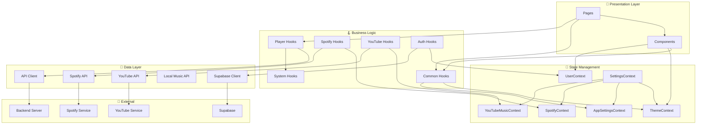
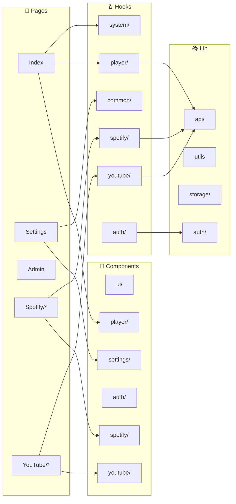
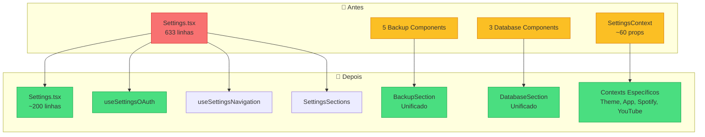

# 🏗️ TSiJUKEBOX - Análise de Arquitetura

<p align="center">
  
</p>

<p align="center">
  <strong>Análise de Arquitetura e Recomendações de Refatoração</strong>
  <br>
  Versão 4.0.0 | Dezembro 2025
</p>

<p align="center">
  
  
  
</p>

---

## 📑 Índice

- [Visão Geral da Arquitetura](#-visão-geral-da-arquitetura)
- [Diagrama de Dependências](#-diagrama-de-dependências)
- [Análise de Complexidade](#-análise-de-complexidade)
- [Pontos Positivos](#-pontos-positivos)
- [Problemas Identificados](#-problemas-identificados)
- [Recomendações de Refatoração](#-recomendações-de-refatoração)
- [Plano de Ação](#-plano-de-ação)
- [Métricas e KPIs](#-métricas-e-kpis)

---

## 🎯 Visão Geral da Arquitetura

O TSiJUKEBOX segue uma arquitetura **component-based** com separação clara de responsabilidades:

```
┌─────────────────────────────────────────────────────────────┐
│                        App.tsx                               │
│                    (Lazy Loading Routes)                     │
└─────────────────────────────┬───────────────────────────────┘
                              │
┌─────────────────────────────▼───────────────────────────────┐
│                     Context Providers                        │
│  ThemeProvider → UserProvider → AppSettingsProvider → ...    │
└─────────────────────────────┬───────────────────────────────┘
                              │
┌─────────────────────────────▼───────────────────────────────┐
│                         Pages (32)                           │
│    Index │ Settings │ Admin │ Spotify │ YouTube │ ...        │
└─────────────────────────────┬───────────────────────────────┘
                              │
┌─────────────────────────────▼───────────────────────────────┐
│                      Components (95+)                        │
│   UI │ Player │ Settings │ Auth │ Spotify │ YouTube │ ...    │
└─────────────────────────────┬───────────────────────────────┘
                              │
┌─────────────────────────────▼───────────────────────────────┐
│                        Hooks (52)                            │
│   Common │ Player │ System │ Spotify │ YouTube │ Auth        │
└─────────────────────────────┬───────────────────────────────┘
                              │
┌─────────────────────────────▼───────────────────────────────┐
│                         Lib (25+)                            │
│     API Clients │ Utils │ Storage │ Validations              │
└─────────────────────────────┬───────────────────────────────┘
                              │
┌─────────────────────────────▼───────────────────────────────┐
│                    Supabase / Backend                        │
│        Edge Functions │ Database │ Auth │ Storage            │
└─────────────────────────────────────────────────────────────┘
```

---

## 🔗 Diagrama de Dependências

### Fluxo de Dados Principal



### Diagrama de Módulos



---

## 📊 Análise de Complexidade

### Métricas por Módulo

| Módulo | Arquivos | Linhas (Est.) | Complexidade | Acoplamento |
|--------|----------|---------------|--------------|-------------|
| `pages/` | 32 | ~6.500 | ⚠️ Média-Alta | Médio |
| `components/ui/` | 50+ | ~4.000 | ✅ Baixa | Baixo |
| `components/player/` | 12 | ~1.500 | ✅ Baixa | Médio |
| `components/settings/` | 28 | ~3.500 | ⚠️ Alta | Alto |
| `hooks/common/` | 20 | ~1.200 | ✅ Baixa | Baixo |
| `hooks/player/` | 7 | ~500 | ✅ Baixa | Médio |
| `hooks/spotify/` | 6 | ~800 | ✅ Baixa | Médio |
| `hooks/youtube/` | 3 | ~400 | ✅ Baixa | Médio |
| `contexts/` | 6 | ~800 | ⚠️ Média | Alto |

### Arquivos Mais Complexos

| Arquivo | Linhas | Problema |
|---------|--------|----------|
| `pages/Settings.tsx` | 633 | 🔴 Muito grande, mistura lógica OAuth com UI |
| `contexts/SettingsContext.tsx` | ~200 | 🟡 Interface muito extensa (~60 propriedades) |
| `pages/Index.tsx` | ~450 | 🟡 Poderia extrair lógica para hooks |
| `components/settings/ThemeCustomizer.tsx` | ~300 | 🟡 Muita lógica inline |

---

## ✅ Pontos Positivos

### 1. Organização de Código

- ✅ **Barrel exports** bem organizados (`index.ts` em cada diretório)
- ✅ **Separação clara** entre hooks por domínio (common, player, spotify, youtube, auth, system)
- ✅ **Hooks compostos** - hooks maiores utilizam hooks menores
- ✅ **Lazy loading** correto em `App.tsx` para todas as rotas

### 2. Qualidade de Código

- ✅ **TypeScript strict** - tipos bem definidos
- ✅ **React Query** para gerenciamento de estado servidor
- ✅ **Hooks customizados** bem abstraídos
- ✅ **Persistência** via localStorage encapsulada

### 3. Padrões de Design

- ✅ **Provider Pattern** para contexts globais
- ✅ **Composition** em vez de herança
- ✅ **Custom Hooks** para reutilização de lógica
- ✅ **Barrel Exports** para imports limpos

### 4. UI/UX

- ✅ **shadcn/ui** como base - componentes acessíveis
- ✅ **Tailwind CSS** para styling consistente
- ✅ **i18n** com 3 idiomas suportados
- ✅ **WCAG 2.1 AA** compliance

---

## ⚠️ Problemas Identificados

### 🔴 Prioridade Alta

#### 1. Settings.tsx Monolítico (633 linhas)

**Problema:** A página Settings.tsx mistura responsabilidades:
- Lógica de OAuth callback (~100 linhas)
- Gerenciamento de navegação por seções
- Renderização condicional de 28+ componentes

**Impacto:** 
- Difícil manutenção
- Testes complexos
- Re-renders desnecessários

**Localização:** `src/pages/Settings.tsx`

#### 2. SettingsContext Muito Extenso

**Problema:** O `SettingsContext` expõe ~60 propriedades, combinando múltiplos concerns:
- Theme settings
- App settings
- Spotify settings
- YouTube settings

**Impacto:**
- Qualquer mudança causa re-render em todos os consumers
- Interface difícil de entender
- Violação do Single Responsibility Principle

**Localização:** `src/contexts/SettingsContext.tsx`

### 🟡 Prioridade Média

#### 3. Componentes Settings Duplicados

**Problema:** Existem componentes com funcionalidade similar:
- `BackupSection` + `UnifiedBackupSection` + `DistributedBackupSection` + `CloudBackupSection` + `ConfigBackupSection`
- `DatabaseSection` + `UnifiedDatabaseSection` + `AdvancedDatabaseSection`

**Impacto:**
- Código duplicado
- Inconsistência de UX
- Manutenção difícil

#### 4. Paridade Incompleta YouTube/Spotify

**Problema:** Spotify tem 6 hooks, YouTube tem apenas 3:

| Spotify | YouTube | Status |
|---------|---------|--------|
| `useSpotifyPlayer` | `useYouTubeMusicPlayer` | ✅ |
| `useSpotifySearch` | `useYouTubeMusicSearch` | ✅ |
| `useSpotifyLibrary` | `useYouTubeMusicLibrary` | ✅ |
| `useSpotifyPlaylists` | - | ❌ Faltando |
| `useSpotifyBrowse` | - | ❌ Faltando |
| `useSpotifyRecommendations` | - | ❌ Faltando |

**Impacto:**
- Funcionalidade desbalanceada
- UX inconsistente entre providers

#### 5. Testes E2E Incompletos para YouTube

**Problema:** Existem testes E2E para Spotify mas não para YouTube Music.

**Localização:** `e2e/specs/`

### 🟢 Prioridade Baixa

#### 6. JSDoc Comments Ausentes

**Problema:** Muitos hooks e funções não têm JSDoc comments.

#### 7. Alguns Types Poderiam Ser Mais Específicos

**Problema:** Uso ocasional de tipos genéricos onde tipos específicos seriam melhores.

---

## 🔧 Recomendações de Refatoração

### 1. Dividir Settings.tsx

**Antes:**
```typescript
// pages/Settings.tsx (633 linhas)
export default function Settings() {
  // Lógica OAuth (~100 linhas)
  const handleOAuthCallback = () => { ... }
  
  // Estado de seção
  const [activeSection, setActiveSection] = useState();
  
  // Render 28+ seções
  return (
    <div>
      {activeSection === 'theme' && <ThemeSection />}
      {activeSection === 'backup' && <BackupSection />}
      // ... 26 mais
    </div>
  );
}
```

**Depois:**
```typescript
// hooks/common/useSettingsOAuth.ts (NOVO)
export function useSettingsOAuth() {
  const handleSpotifyCallback = useCallback(() => { ... }, []);
  const handleYouTubeCallback = useCallback(() => { ... }, []);
  
  return { handleSpotifyCallback, handleYouTubeCallback };
}

// pages/Settings.tsx (~200 linhas)
export default function Settings() {
  const { activeSection, setActiveSection } = useSettingsNavigation();
  useSettingsOAuth(); // Side effects apenas
  
  return (
    <SettingsLayout activeSection={activeSection}>
      <SettingsSections />
    </SettingsLayout>
  );
}

// components/settings/SettingsSections.tsx (NOVO)
export function SettingsSections({ activeSection }) {
  const sections = useMemo(() => ({
    theme: ThemeSection,
    backup: BackupSection,
    // ...
  }), []);
  
  const ActiveComponent = sections[activeSection];
  return <ActiveComponent />;
}
```

### 2. Simplificar SettingsContext

**Antes:**
```typescript
// contexts/SettingsContext.tsx
interface SettingsContextType {
  // ~60 propriedades de ThemeContext + AppSettingsContext + SpotifyContext + YouTubeContext
}
```

**Depois:**
```typescript
// Usar hooks específicos diretamente
import { useTheme } from '@/contexts/ThemeContext';
import { useAppSettings } from '@/contexts/AppSettingsContext';
import { useSpotify } from '@/contexts/SpotifyContext';

// SettingsContext pode ser deprecated ou simplificado para apenas navegação
```

### 3. Consolidar Componentes de Backup

**Antes:**
```
components/settings/
├── BackupSection.tsx
├── BackupScheduleSection.tsx
├── CloudBackupSection.tsx
├── ConfigBackupSection.tsx
├── DistributedBackupSection.tsx
└── UnifiedBackupSection.tsx
```

**Depois:**
```typescript
// components/settings/BackupSection/index.tsx
export function BackupSection() {
  return (
    <div className="space-y-6">
      <BackupLocal />
      <BackupCloud />
      <BackupSchedule />
    </div>
  );
}

// Subcomponentes internos
function BackupLocal() { ... }
function BackupCloud() { ... }
function BackupSchedule() { ... }
```

### 4. Completar Hooks YouTube

```typescript
// hooks/youtube/useYouTubeMusicPlaylists.ts (NOVO)
export function useYouTubeMusicPlaylists() {
  // Similar ao useSpotifyPlaylists
}

// hooks/youtube/useYouTubeMusicBrowse.ts (NOVO)
export function useYouTubeMusicBrowse() {
  // Similar ao useSpotifyBrowse
}

// hooks/youtube/useYouTubeMusicRecommendations.ts (NOVO)
export function useYouTubeMusicRecommendations() {
  // Similar ao useSpotifyRecommendations
}
```

---

## 📋 Plano de Ação

### Fase 1: Quick Wins (1-2 dias)

| Tarefa | Impacto | Esforço | Prioridade |
|--------|---------|---------|------------|
| Extrair `useSettingsOAuth` de Settings.tsx | Alto | Baixo | 🔴 Alta |
| Adicionar JSDoc aos hooks principais | Médio | Baixo | 🟢 Baixa |
| Criar barrel export para YouTube hooks | Baixo | Baixo | 🟢 Baixa |

### Fase 2: Refatoração Estrutural (3-5 dias)

| Tarefa | Impacto | Esforço | Prioridade |
|--------|---------|---------|------------|
| Dividir Settings.tsx em componentes menores | Alto | Médio | 🔴 Alta |
| Consolidar componentes de backup | Médio | Médio | 🟡 Média |
| Consolidar componentes de database | Médio | Médio | 🟡 Média |

### Fase 3: Paridade de Features (1 semana)

| Tarefa | Impacto | Esforço | Prioridade |
|--------|---------|---------|------------|
| Criar `useYouTubeMusicPlaylists` | Alto | Médio | 🟡 Média |
| Criar `useYouTubeMusicBrowse` | Alto | Médio | 🟡 Média |
| Criar `useYouTubeMusicRecommendations` | Médio | Médio | 🟡 Média |
| Adicionar testes E2E YouTube | Alto | Alto | 🟡 Média |

### Fase 4: Otimização (Contínuo)

| Tarefa | Impacto | Esforço | Prioridade |
|--------|---------|---------|------------|
| Code splitting adicional | Médio | Baixo | 🟢 Baixa |
| Memoização de componentes pesados | Médio | Baixo | 🟢 Baixa |
| Bundle size optimization | Médio | Médio | 🟢 Baixa |

---

## 📈 Métricas e KPIs

### Métricas Atuais (Estimativas)

| Métrica | Valor Atual | Meta |
|---------|-------------|------|
| Bundle Size (gzip) | ~350KB | <300KB |
| Maior arquivo | 633 linhas | <400 linhas |
| Cobertura de testes | ~60% | >80% |
| Hooks por domínio | 3-20 | Balanceado |
| Tempo de build | ~45s | <30s |

### Checklist de Qualidade

- [ ] Nenhum arquivo >400 linhas
- [ ] Todos os hooks documentados com JSDoc
- [ ] Cobertura de testes >80%
- [ ] Paridade de features YouTube/Spotify
- [ ] Bundle size <300KB
- [ ] Lighthouse Performance >90

---

## 🔄 Diagrama de Refatoração Proposta



---

## 📚 Recursos Adicionais

- [API Reference](API-REFERENCE.md) - Documentação completa de hooks e contexts
- [Project Map](PROJECT-MAP.md) - Mapa completo de arquivos
- [Developer Guide](DEVELOPER-GUIDE.md) - Guia do desenvolvedor
- [Contributing](CONTRIBUTING.md) - Como contribuir

---

<p align="center">
  <strong>TSiJUKEBOX Architecture Analysis</strong>
  <br>
  Gerado em Dezembro 2025
</p>
