# 🏗️ Arquitetura do Sistema TSiJUKEBOX

<p align="center">
  
</p>

<p align="center">
  <strong>Documentação Técnica da Arquitetura</strong>
  <br>
  Versão 4.0.0
</p>

---

## 📋 Índice

- [Visão Geral](#visão-geral)
- [Arquitetura de Alto Nível](#arquitetura-de-alto-nível)
- [Fluxo de Dados](#fluxo-de-dados)
- [Estrutura de Componentes](#estrutura-de-componentes)
- [Modelo de Dados](#modelo-de-dados)
- [Organização de Hooks](#organização-de-hooks)
- [Fluxo de Autenticação](#fluxo-de-autenticação)
- [Integrações Externas](#integrações-externas)
- [Sistema de Auto-Sync](#sistema-de-auto-sync)
- [Estrutura de Diretórios](#estrutura-de-diretórios)

---

## Visão Geral

TSiJUKEBOX é uma Progressive Web Application (PWA) enterprise para sistemas de música em modo kiosk. A arquitetura segue os princípios de:

- **Separação de Responsabilidades**: UI, lógica de negócio e dados claramente separados
- **Componentização**: Componentes reutilizáveis e independentes
- **Type Safety**: TypeScript em todo o codebase
- **Acessibilidade**: WCAG 2.1 AA compliance
- **Offline-First**: PWA com suporte offline

---

## Arquitetura de Alto Nível

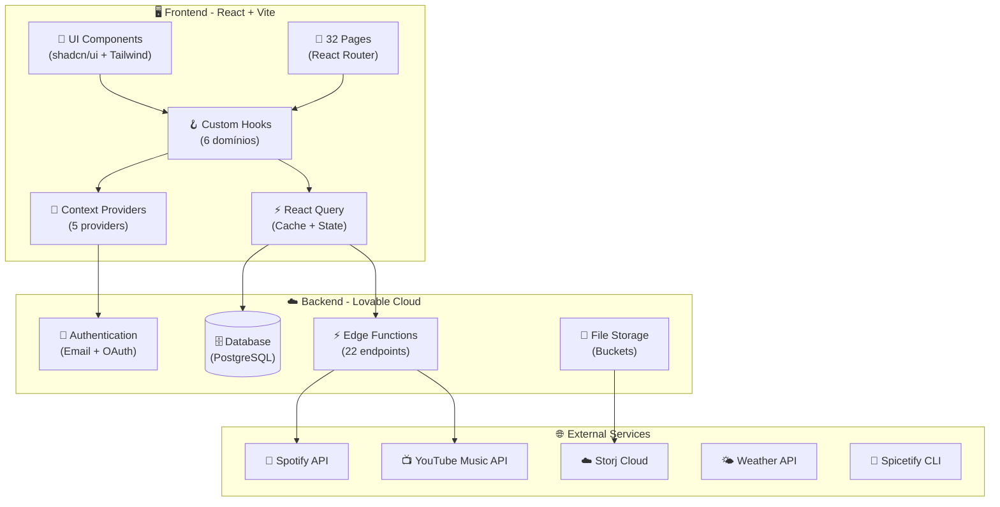

---

## Fluxo de Dados

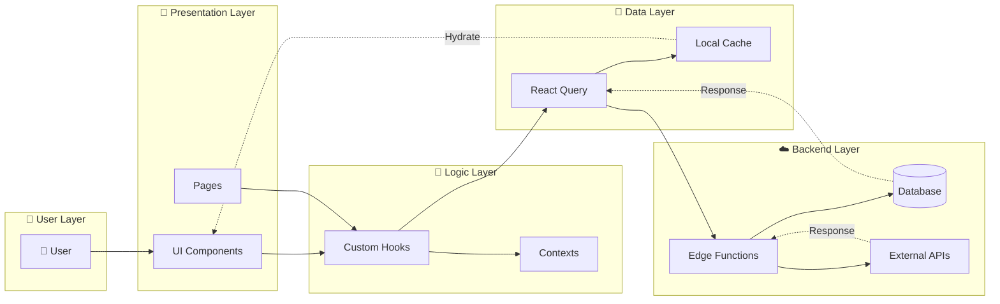

---

## Estrutura de Componentes

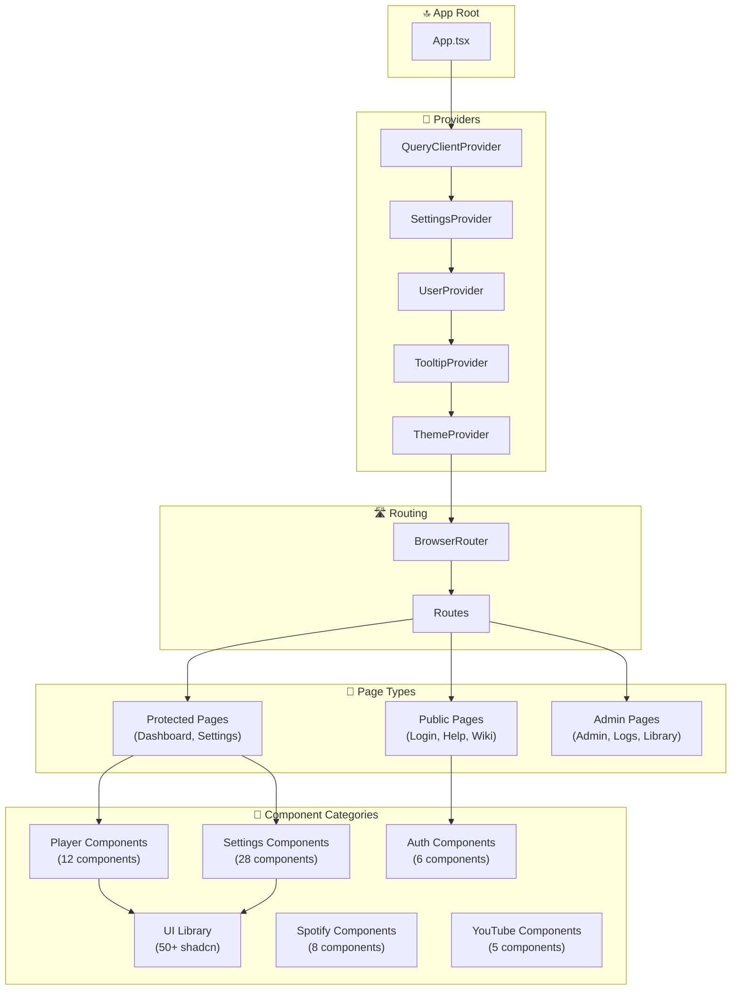

---

## Modelo de Dados

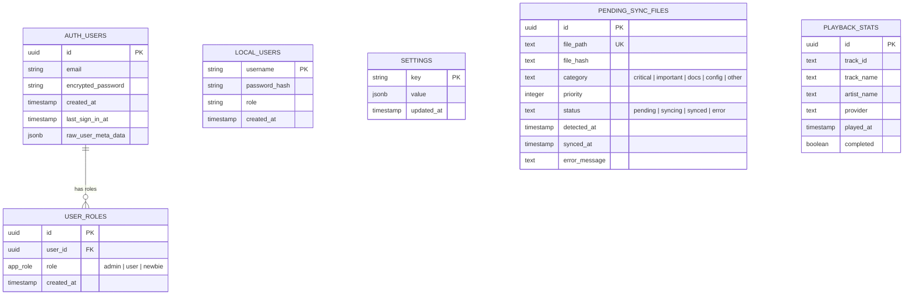

### Tipos de Role

| Role | Descrição | Permissões |
|------|-----------|------------|
| `admin` | Administrador | Acesso total ao sistema |
| `user` | Usuário padrão | Controle de reprodução, playlists |
| `newbie` | Novo usuário | Acesso limitado, apenas visualização |

---

## Organização de Hooks

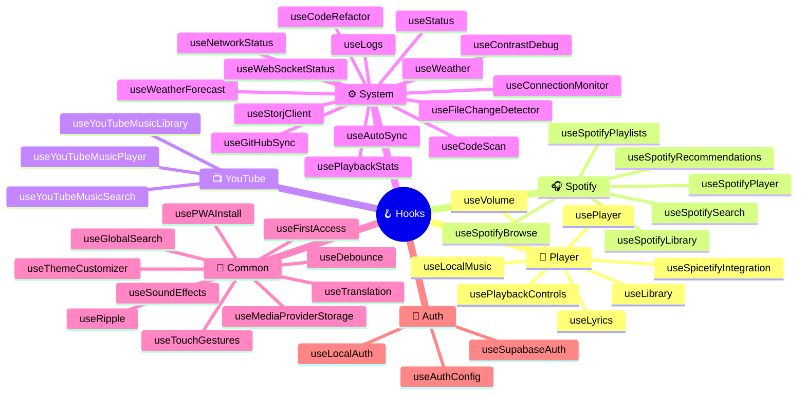

### Padrão de Importação

```typescript
// ✅ Recomendado: Import do barrel principal
import { usePlayer, useTranslation, useSpotifySearch } from '@/hooks';

// ✅ Alternativo: Import por categoria
import { usePlayer, useVolume } from '@/hooks/player';

// ❌ Evitar: Import direto do arquivo
import { usePlayer } from '@/hooks/player/usePlayer';
```

---

## Fluxo de Autenticação

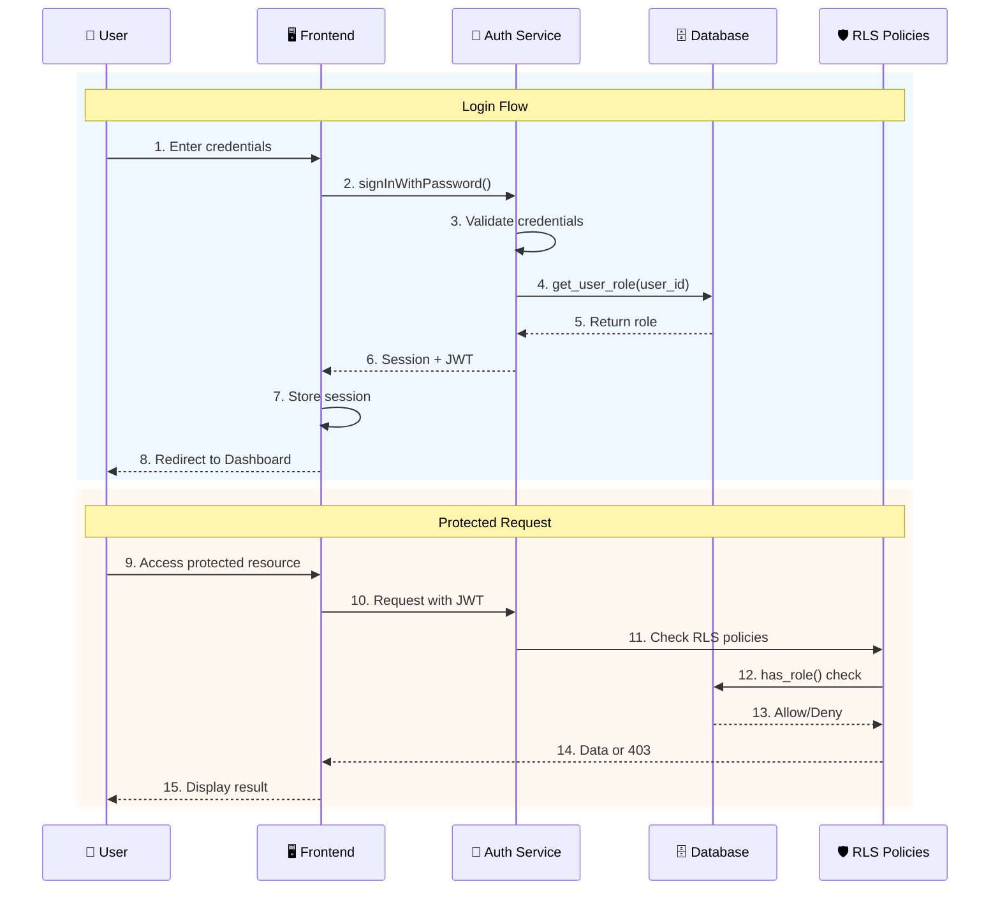

### Modos de Autenticação

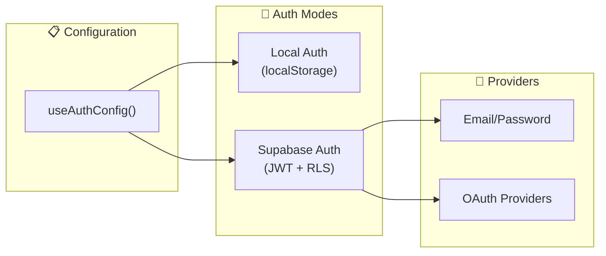

---

## Integrações Externas

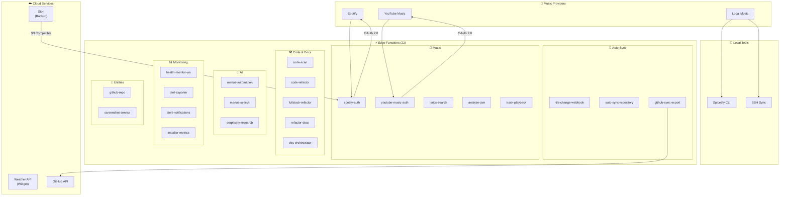

### Edge Functions (22 funções)

| Categoria | Função | Descrição |
|-----------|--------|-----------|
| **Auto-Sync** | `file-change-webhook` | Recebe detecção de mudanças de arquivos |
| **Auto-Sync** | `auto-sync-repository` | Orquestra push automático para GitHub |
| **Auto-Sync** | `github-sync-export` | Cria commits e pushes no GitHub |
| **Music** | `spotify-auth` | OAuth flow do Spotify |
| **Music** | `youtube-music-auth` | OAuth flow do YouTube Music |
| **Music** | `lyrics-search` | Busca de letras sincronizadas |
| **Music** | `analyze-jam` | Análise de sessões Jam colaborativas |
| **Music** | `track-playback` | Estatísticas de reprodução |
| **Code** | `code-scan` | Análise de qualidade de código |
| **Code** | `code-refactor` | Refatoração automática de código |
| **Code** | `fullstack-refactor` | Refatoração fullstack completa |
| **Docs** | `refactor-docs` | Geração de documentação |
| **Docs** | `doc-orchestrator` | Orquestração de documentação |
| **AI** | `manus-automation` | Automação com Manus AI |
| **AI** | `manus-search` | Busca inteligente com Manus |
| **AI** | `perplexity-research` | Pesquisa com Perplexity AI |
| **Monitoring** | `health-monitor-ws` | Monitor de saúde via WebSocket |
| **Monitoring** | `otel-exporter` | Exportador OpenTelemetry |
| **Monitoring** | `alert-notifications` | Sistema de notificações e alertas |
| **Monitoring** | `installer-metrics` | Métricas de instalação |
| **Utility** | `github-repo` | Integração geral com GitHub |
| **Utility** | `screenshot-service` | Serviço de capturas de tela |

---

## Sistema de Auto-Sync

O TSiJUKEBOX possui um sistema automático de sincronização com GitHub que detecta mudanças em arquivos durante o desenvolvimento e cria commits automaticamente.

### Arquitetura do Auto-Sync

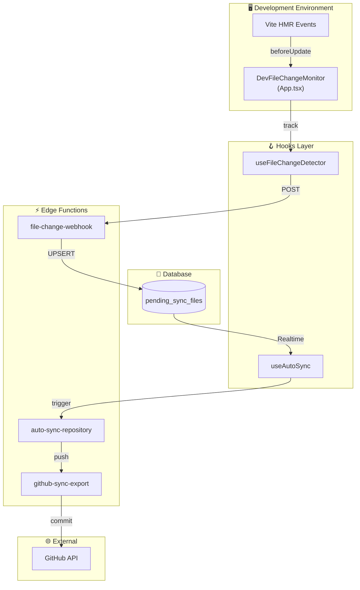

### Fluxo de Detecção de Arquivos

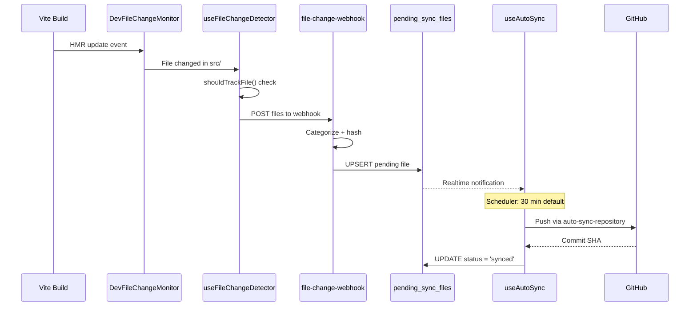

### Padrões de Arquivos

| Categoria | Padrão | Prioridade |
|-----------|--------|------------|
| **Critical** | `src/**/*.tsx`, `src/**/*.ts` | 1 |
| **Important** | `supabase/functions/**/*` | 2 |
| **Docs** | `docs/**/*.md`, `*.md` | 3 |
| **Config** | `*.json`, `*.toml`, `*.yaml` | 4 |
| **Other** | Demais arquivos | 5 |

### Hooks do Sistema

```typescript
// Detecção de mudanças (DEV only)
const { 
  detectedFiles, 
  isDetecting, 
  startDetection,
  stopDetection,
  submitFilesForSync 
} = useFileChangeDetector();

// Sincronização automática
const {
  isEnabled,
  pendingCount,
  nextSync,
  enable,
  disable,
  triggerSync,
  setSyncInterval
} = useAutoSync();
```

---

## Estrutura de Diretórios

```
TSiJUKEBOX/
├── 📁 src/
│   ├── 📁 components/          # Componentes React
│   │   ├── 📁 auth/            # Autenticação (6)
│   │   ├── 📁 player/          # Player de música (12)
│   │   ├── 📁 settings/        # Configurações (28)
│   │   ├── 📁 spotify/         # Spotify (8)
│   │   ├── 📁 youtube/         # YouTube (5)
│   │   ├── 📁 ui/              # shadcn/ui (50+)
│   │   └── 📁 ...              # Outros
│   │
│   ├── 📁 contexts/            # React Contexts (5)
│   │   ├── AppSettingsContext.tsx
│   │   ├── SettingsContext.tsx
│   │   ├── SpotifyContext.tsx
│   │   ├── ThemeContext.tsx
│   │   ├── UserContext.tsx
│   │   └── YouTubeMusicContext.tsx
│   │
│   ├── 📁 hooks/               # Custom Hooks
│   │   ├── 📁 auth/            # Auth hooks (3)
│   │   ├── 📁 common/          # Hooks comuns (18)
│   │   ├── 📁 pages/           # Page-specific (1)
│   │   ├── 📁 player/          # Player hooks (7)
│   │   ├── 📁 spotify/         # Spotify hooks (6)
│   │   ├── 📁 system/          # System hooks (12)
│   │   └── 📁 youtube/         # YouTube hooks (3)
│   │
│   ├── 📁 pages/               # 32 Pages
│   ├── 📁 lib/                 # Utilitários
│   ├── 📁 types/               # TypeScript types
│   ├── 📁 i18n/                # Internacionalização
│   └── 📁 integrations/        # Supabase client
│
├── 📁 supabase/
│   ├── 📁 functions/           # Edge Functions (22)
│   └── config.toml             # Supabase config
│
├── 📁 docs/                    # Documentação
├── 📁 e2e/                     # Testes E2E
├── 📁 scripts/                 # Scripts de automação
└── 📁 packaging/               # Pacotes de distribuição
    └── 📁 arch/                # Arch Linux PKGBUILD
```

---

## Stack Tecnológico

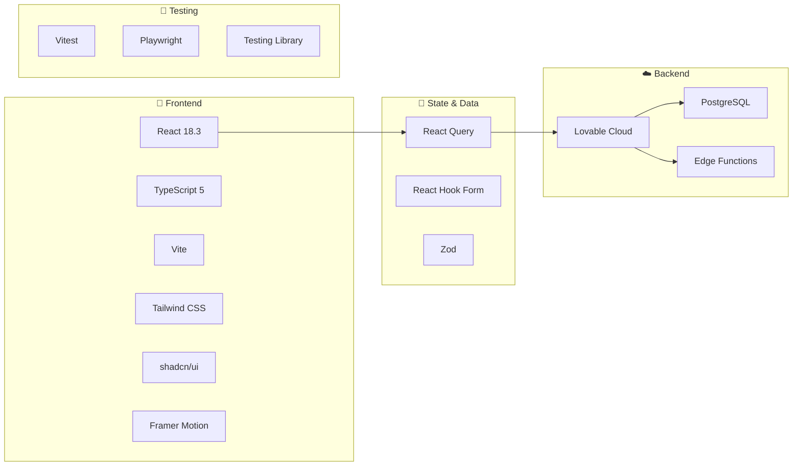

---

## Performance & Otimizações

### Lazy Loading

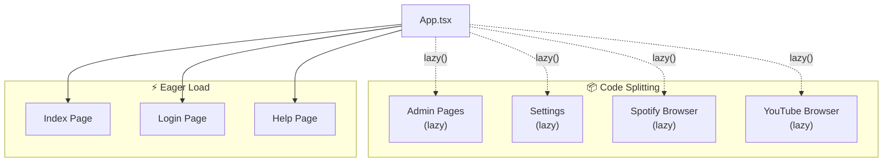

### Caching Strategy

| Camada | TTL | Estratégia |
|--------|-----|------------|
| React Query | 5 min | staleWhileRevalidate |
| Service Worker | 24h | Cache First |
| localStorage | Permanente | User preferences |
| sessionStorage | Session | Temp state |

---

## Segurança

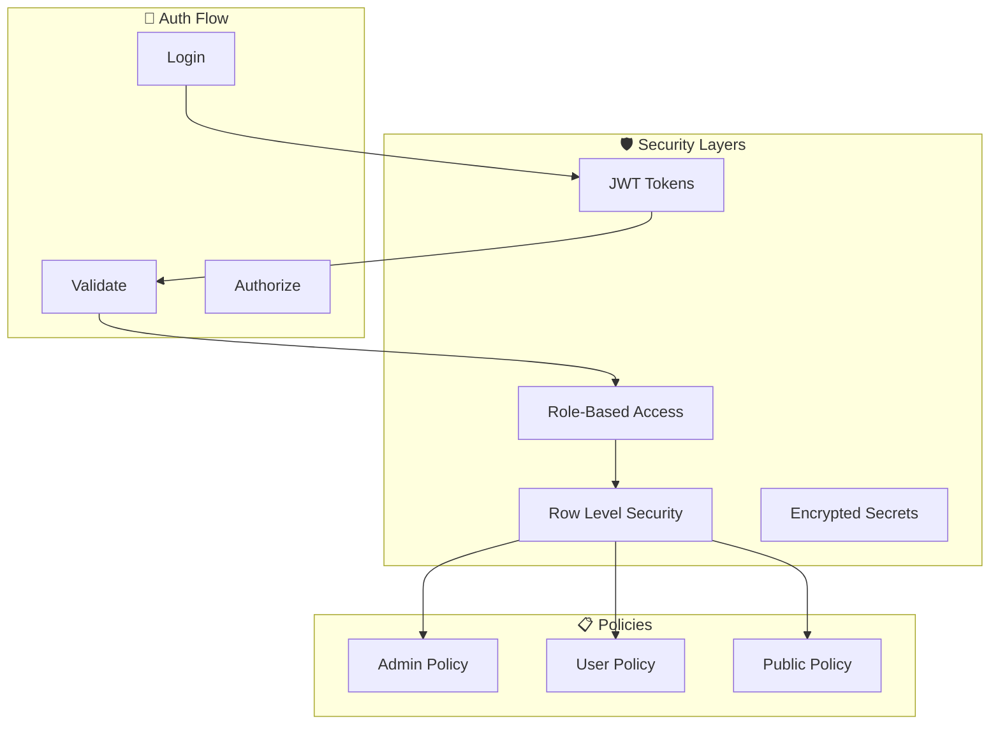

---

## Próximos Passos

- [x] ~~Implementar WebSocket para real-time updates~~ ✅ (Realtime em pending_sync_files)
- [x] ~~Implementar CI/CD pipeline completo~~ ✅ (Sistema de Auto-Sync)
- [x] ~~Sistema de detecção de mudanças~~ ✅ (useFileChangeDetector + DevFileChangeMonitor)
- [x] ~~Testes unitários para hooks de sistema~~ ✅ (useAutoSync + useFileChangeDetector tests)
- [ ] Adicionar suporte a múltiplos idiomas (i18n completo)
- [ ] Implementar modo offline com IndexedDB
- [ ] Adicionar testes E2E para Edge Functions
- [ ] Dashboard de métricas de Auto-Sync
- [ ] Implementar retry automático em falhas de sync

---

<p align="center">
  <strong>TSiJUKEBOX Enterprise</strong> — Arquitetura Escalável
  <br>
  Última atualização: Dezembro 2025
</p>
