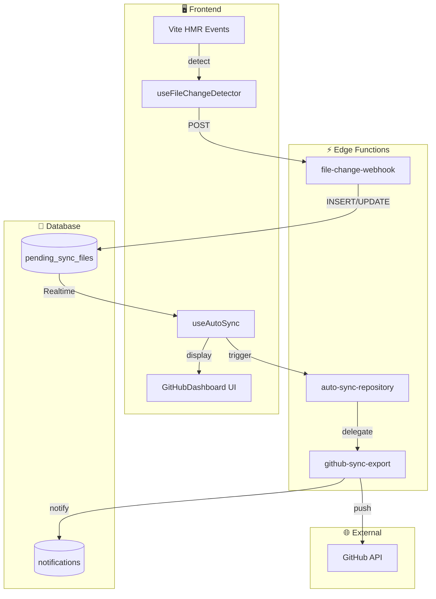
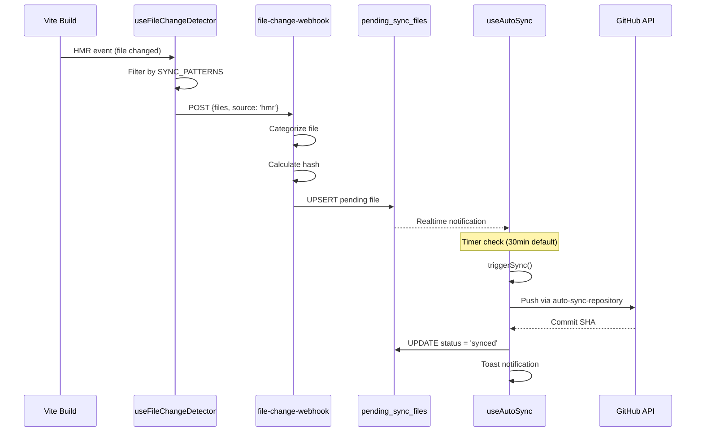

# 🔄 Sistema de Auto-Sync

O TSiJUKEBOX possui um sistema automático de sincronização com GitHub que detecta mudanças em arquivos e faz push automático.

---

## 📐 Arquitetura



---

## 🔄 Fluxo de Detecção



---

## 🧩 Componentes

### 1. `useFileChangeDetector` Hook

Detecta mudanças em arquivos via Vite HMR e envia para o webhook.

```typescript
import { useFileChangeDetector } from '@/hooks/system';

const {
  detectedFiles,      // Array de arquivos detectados
  isDetecting,        // Status de detecção ativa
  lastDetection,      // Timestamp da última detecção
  submitFilesForSync, // Submeter arquivos manualmente
  startDetection,     // Iniciar detecção
  stopDetection,      // Parar detecção
  clearDetected       // Limpar lista
} = useFileChangeDetector();
```

**Padrões Monitorados:**
- `src/**/*.{ts,tsx,js,jsx,css,scss}`
- `docs/**/*.{md,mdx}`
- `supabase/functions/**/*.ts`
- `public/**/*`

**Padrões Ignorados:**
- `node_modules/`
- `.git/`
- `dist/`
- `*.test.{ts,tsx}`
- `*.spec.{ts,tsx}`

---

### 2. `useAutoSync` Hook

Gerencia a sincronização automática com scheduler e Realtime.

```typescript
import { useAutoSync } from '@/hooks/system';

const {
  // Status
  isEnabled,          // Auto-sync está ativo
  isSyncing,          // Sincronização em andamento
  pendingFiles,       // Arquivos aguardando sync
  lastSync,           // Último sync realizado
  nextSync,           // Próximo sync agendado
  syncInterval,       // Intervalo em minutos
  
  // Ações
  enable,             // Ativar auto-sync
  disable,            // Desativar
  toggle,             // Alternar
  triggerSync,        // Sincronizar agora
  setSyncInterval,    // Alterar intervalo
  addPendingFile,     // Adicionar arquivo
  clearPendingFiles,  // Limpar pendentes
} = useAutoSync();
```

---

### 3. `file-change-webhook` Edge Function

Endpoint que processa notificações de mudança de arquivos.

**Request:**
```json
POST /functions/v1/file-change-webhook
{
  "files": [
    { "path": "src/App.tsx", "hash": "abc123" },
    { "path": "src/components/Button.tsx" }
  ],
  "source": "hmr"
}
```

**Response:**
```json
{
  "success": true,
  "summary": {
    "added": 1,
    "updated": 1,
    "unchanged": 0,
    "total": 2
  },
  "files": [
    { "path": "src/App.tsx", "status": "added" },
    { "path": "src/components/Button.tsx", "status": "updated" }
  ]
}
```

---

### 4. `pending_sync_files` Table

Tabela que persiste arquivos pendentes de sincronização.

| Coluna | Tipo | Descrição |
|--------|------|-----------|
| `id` | UUID | Chave primária |
| `file_path` | TEXT | Caminho do arquivo (único) |
| `file_hash` | TEXT | Hash do conteúdo |
| `category` | TEXT | critical, important, docs, config, other |
| `priority` | INTEGER | 1-10 (menor = mais prioritário) |
| `status` | TEXT | pending, syncing, synced, error |
| `detected_at` | TIMESTAMP | Quando foi detectado |
| `synced_at` | TIMESTAMP | Quando foi sincronizado |
| `error_message` | TEXT | Mensagem de erro (se houver) |

---

## ⚙️ Configuração

### Intervalo de Sync

| Valor | Uso |
|-------|-----|
| 5 min | Desenvolvimento ativo |
| 15 min | Trabalho normal |
| 30 min | Default recomendado |
| 60 min | Economia de requests |

```typescript
// Alterar intervalo programaticamente
const { setSyncInterval } = useAutoSync();
setSyncInterval(15); // 15 minutos
```

### Categorias de Arquivos

| Categoria | Prioridade | Padrão |
|-----------|------------|--------|
| critical | 1 | App.tsx, main.tsx, package.json |
| important | 2 | Componentes, hooks, pages |
| config | 3 | JSON, YAML, TOML |
| docs | 4 | Markdown, README |
| other | 10 | Demais arquivos |

---

## 🚨 Troubleshooting

### Arquivos não detectados

1. Verifique se o padrão está em `SYNC_PATTERNS`
2. Confirme que não está em `IGNORE_PATTERNS`
3. Verifique console para logs `[useFileChangeDetector]`

### Sync falha

1. Verifique `GITHUB_ACCESS_TOKEN` nos secrets
2. Confira permissões do token (repo scope)
3. Verifique logs da Edge Function

### Realtime não atualiza

1. Verifique se a tabela está na publicação:
   ```sql
   SELECT * FROM pg_publication_tables 
   WHERE pubname = 'supabase_realtime';
   ```
2. Verifique RLS policies

---

## 📊 Monitoramento

### Via GitHubDashboard

O dashboard exibe:
- Status do auto-sync (ativo/inativo)
- Arquivos pendentes com contagem
- Tempo até próximo sync
- Histórico de commits

### Via Logs

```bash
# Edge Function logs
supabase functions logs file-change-webhook
supabase functions logs auto-sync-repository

# Consultar tabela
supabase db query "SELECT * FROM pending_sync_files ORDER BY detected_at DESC LIMIT 10"
```

---

## 🔐 Segurança

- Webhook aceita apenas requests válidos
- Categorização automática previne sync de arquivos sensíveis
- RLS policies protegem a tabela
- Secrets são armazenados de forma segura

---

## 📚 Relacionados

- [Arquitetura do Sistema](wiki/Dev-Architecture.md)
- [Edge Functions](wiki/Dev-API-Reference.md)
- [GitHubDashboard](../src/pages/GitHubDashboard.tsx)
