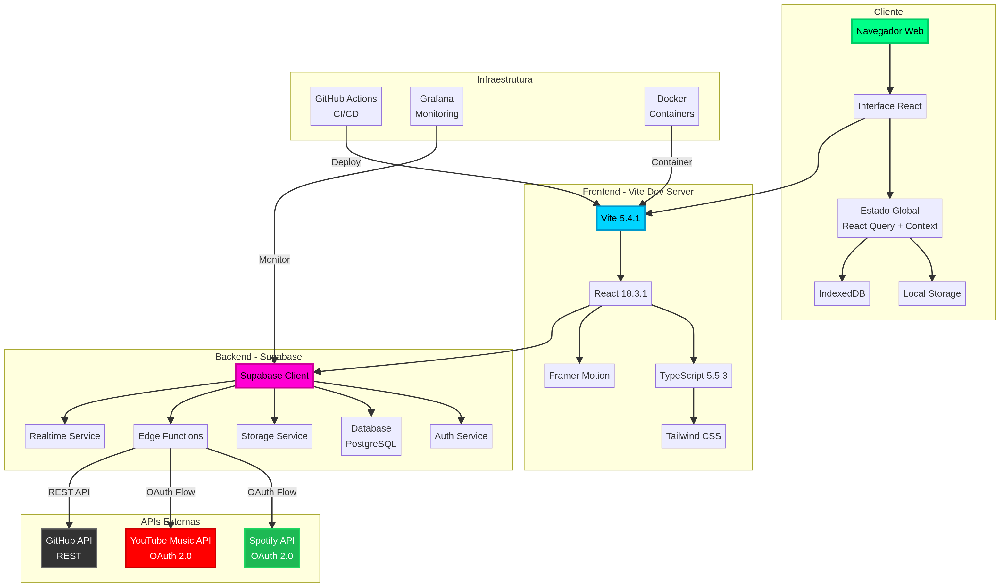

# Assets Visuais - TSiJUKEBOX

Este diretório contém todos os assets visuais do projeto TSiJUKEBOX.

## 📁 Estrutura

```
assets/
├── icons/           # Ícones modernos para seções da documentação
├── diagrams/        # Diagramas técnicos (Mermaid + PNG)
├── screenshots/     # Screenshots da aplicação
├── logo.svg         # Logo oficial do TSiJUKEBOX
└── B0.y_Z4kr14-v3.png  # Avatar do desenvolvedor
```

## 🎨 Ícones (8 total)

| Ícone | Nome | Uso |
| :---: | :--- | :--- |
|  | `installation.png` | Documentação de instalação |
|  | `configuration.png` | Documentação de configuração |
|  | `tutorials.png` | Tutoriais e guias |
|  | `development.png` | Documentação de desenvolvimento |
|  | `api.png` | Documentação de API |
|  | `security.png` | Documentação de segurança |
|  | `monitoring.png` | Monitoramento e analytics |
|  | `testing.png` | Testes e QA |

## 📊 Diagramas Técnicos (16 total)

### Arquitetura

| Diagrama | Descrição |
| :--- | :--- |
| `architecture-general.png` | Arquitetura geral do sistema (Frontend, Backend, APIs) |
| `architecture-components.png` | Estrutura de componentes React |
| `deployment-architecture.png` | Arquitetura de deploy (CDN, Load Balancer, Servers) |

### Fluxos OAuth 2.0

| Diagrama | Descrição |
| :--- | :--- |
| `oauth-spotify-flow.png` | Fluxo completo de autenticação Spotify (32 etapas) |
| `oauth-youtube-flow.png` | Fluxo completo de autenticação YouTube Music (33 etapas) |
| `auth-flow.png` | Fluxo de autenticação Supabase (Email, Google, GitHub) |

### CI/CD e DevOps

| Diagrama | Descrição |
| :--- | :--- |
| `cicd-pipeline.png` | Pipeline completo de CI/CD (GitHub Actions) |
| `monitoring-stack.png` | Stack de monitoramento (Prometheus + Grafana) |
| `backup-strategy.png` | Estratégia de backup (Full, Incremental, Transaction Log) |
| `testing-strategy.png` | Estratégia de testes (Unit, Integration, E2E, Performance, Security) |

### Funcionalidades

| Diagrama | Descrição |
| :--- | :--- |
| `player-data-flow.png` | Fluxo de dados do player (State Management, Audio Sources) |
| `setup-wizard-flow.png` | Fluxo do Setup Wizard (9 etapas) |
| `karaoke-mode-flow.png` | Fluxo do modo karaoke |
| `kiosk-mode-architecture.png` | Arquitetura do modo kiosk (CachyOS + Openbox) |
| `feature-flags-system.png` | Sistema de feature flags e A/B testing |

### Banco de Dados

| Diagrama | Descrição |
| :--- | :--- |
| `database-schema.png` | Schema completo do banco de dados (ER Diagram) |

## 🖼️ Screenshots

*Em desenvolvimento - serão adicionados na Fase 2*

## 📝 Uso nas Documentações

Para usar os assets nas documentações, utilize os caminhos relativos:

```markdown
# Exemplo de uso de ícone


# Exemplo de uso de diagrama

```

## 🎨 Paleta de Cores

| Cor | Hex | Uso |
| :--- | :--- | :--- |
| Verde Neon | `#00ff88` | Instalação, sucesso |
| Ciano | `#00d4ff` | Configuração, informação |
| Magenta | `#ff00d4` | Tutoriais, destaque |
| Amarelo Ouro | `#ffd400` | Desenvolvimento, atenção |
| Roxo | `#d400ff` | API, dados |
| Laranja | `#ff4400` | Segurança, alerta |
| Verde Lima | `#00ff44` | Monitoramento, ativo |
| Azul Elétrico | `#4400ff` | Testes, qualidade |

---

**Desenvolvido por [B0.y_Z4kr14](https://github.com/B0yZ4kr14)** • *TSI Telecom*
