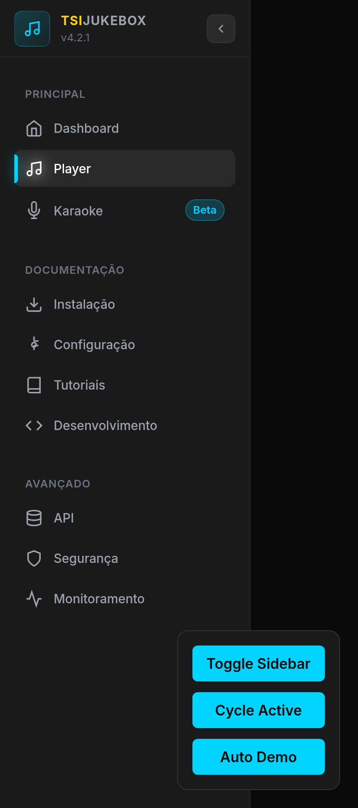
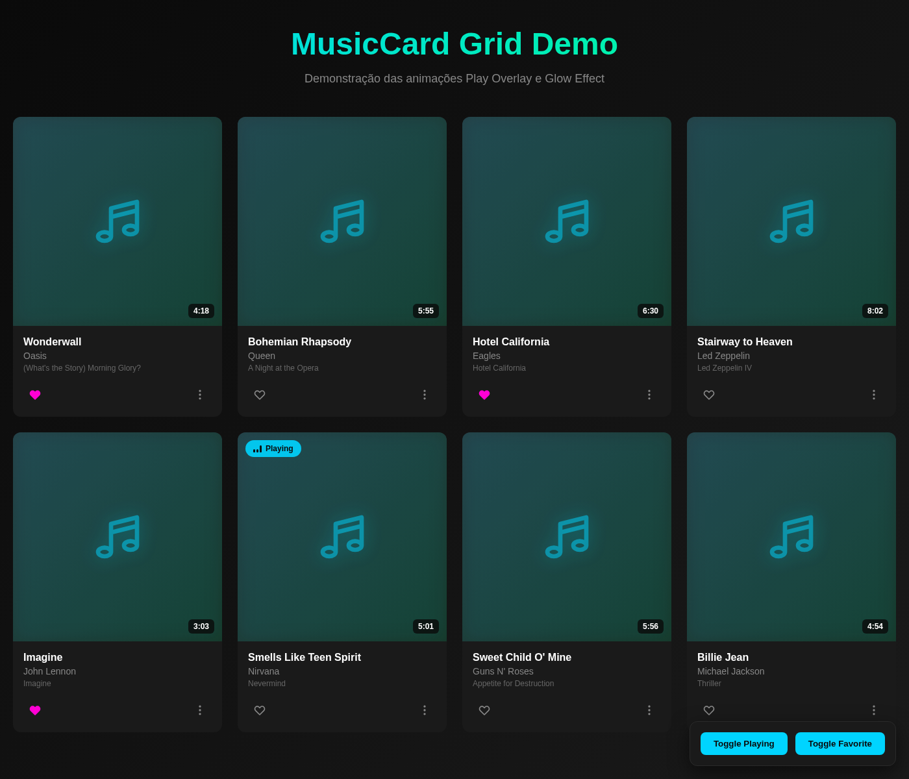

# TSiJUKEBOX - Demonstrações Visuais

Demonstrações animadas dos componentes principais do TSiJUKEBOX.

---

## 1. GlobalSidebar Demo

**Arquivo:** `global-sidebar-demo.gif`  
**Tamanho:** 850KB  
**Duração:** 30 segundos  
**FPS:** 15  
**Resolução:** 400x900px

### Demonstra:

1. **Glow Effect** (0-5s)
   - Alternância entre itens de navegação
   - Efeito de brilho (glow) nos ícones ativos
   - Cores neon específicas por seção
   - Animação de pulse contínua

2. **Collapse Animation** (5-8s)
   - Transição suave de 280px → 80px
   - Fade out de labels e badges
   - Reposicionamento do botão de toggle
   - Duração: 300ms com cubic-bezier easing

3. **Expand Animation** (8-11s)
   - Transição de 80px → 280px
   - Fade in de labels e badges
   - Restauração do layout completo

4. **Ciclo Completo** (11-30s)
   - Demonstração de múltiplas transições
   - Alternância de itens ativos
   - Showcase de todas as cores das seções

### Cores por Seção

| Seção | Cor | Hex |
|-------|-----|-----|
| Dashboard | Cyan | #00d4ff |
| Instalação | Verde Neon | #00ff88 |
| Configuração | Cyan | #00d4ff |
| Tutoriais | Magenta | #ff00d4 |
| Desenvolvimento | Amarelo Ouro | #ffd400 |
| API | Roxo | #d400ff |
| Segurança | Laranja | #ff4400 |
| Monitoramento | Verde Lima | #00ff44 |

### Screenshot:



---

## 2. MusicCard Grid Demo

**Arquivo:** `music-card-demo.gif`  
**Tamanho:** 29MB  
**Duração:** 36 segundos  
**FPS:** 10  
**Resolução:** 800x686px

### Demonstra:

- 🎵 **Grid 4x2**: Layout de 8 músicas clássicas
- ▶️ **Play Overlay**: Animação de hover com botão play
- ❤️ **Favorite Toggle**: Alternância de favoritos (magenta)
- ⏱️ **Duration Badge**: Duração no canto superior direito
- 🎨 **Glow Effect**: Efeito de brilho nos ícones
- 🎭 **Hover States**: Transformações suaves
- 🎬 **Auto Animation**: Ciclo automático de demonstração

### Músicas Incluídas:

1. **Wonderwall** - Oasis (4:18)
2. **Bohemian Rhapsody** - Queen (5:55)
3. **Hotel California** - Eagles (6:30)
4. **Stairway to Heaven** - Led Zeppelin (8:02)
5. **Imagine** - John Lennon (3:03)
6. **Smells Like Teen Spirit** - Nirvana (5:01)
7. **Sweet Child O' Mine** - Guns N' Roses (5:56)
8. **Billie Jean** - Michael Jackson (4:54)

### Screenshot:



---

## Uso das Demonstrações

### Em Documentação

```markdown


```

### Em README

```markdown
## Navegação

O TSiJUKEBOX possui uma sidebar moderna com animações suaves:


## Biblioteca de Músicas

Grid responsivo com cards interativos:


```

### Em Apresentações

Use os arquivos `.gif` diretamente em slides, documentos ou apresentações.

---

## Páginas HTML Standalone

### GlobalSidebar

**Arquivo:** `/public/sidebar-demo.html`  
**URL:** `http://localhost:5173/sidebar-demo.html`

Demonstração standalone da sidebar com controles interativos.

**Controles:**
- Toggle Sidebar
- Cycle Active
- Auto Demo

### MusicCard Grid

**Arquivo:** `/public/music-card-demo.html`  
**URL:** `http://localhost:5173/music-card-demo.html`

Demonstração standalone do grid de músicas com animações automáticas.

**Controles:**
- Toggle Playing
- Toggle Favorite

---

## Processo de Criação

### 1. Captura de Frames

```javascript
// Puppeteer automation
const browser = await puppeteer.launch();
const page = await browser.newPage();
await page.goto('file:///path/to/demo.html');

for (let i = 0; i < totalFrames; i++) {
  await page.screenshot({ path: `frame-${i}.png` });
  await page.evaluate(() => window.advanceFrame());
}
```

### 2. Conversão para GIF

```bash
# GlobalSidebar (15 FPS, 255 cores)
ffmpeg -framerate 15 -pattern_type glob -i 'frame-*.png' \
  -vf "fps=15,scale=400:-1:flags=lanczos,split[s0][s1];[s0]palettegen=max_colors=255[p];[s1][p]paletteuse=dither=bayer:bayer_scale=5" \
  -y global-sidebar-demo.gif

# MusicCard Grid (10 FPS, 128 cores)
ffmpeg -framerate 10 -pattern_type glob -i 'frame-*.png' \
  -vf "fps=10,scale=800:-1:flags=lanczos,split[s0][s1];[s0]palettegen=max_colors=128[p];[s1][p]paletteuse=dither=bayer:bayer_scale=3" \
  -y music-card-demo.gif
```

### 3. Otimização

- **FPS**: 30 → 15/10 (redução de frames)
- **Resolução**: Escala proporcional
- **Paleta**: 255/128 cores otimizadas
- **Dithering**: Bayer algorithm para suavização

---

## Especificações Técnicas

| Demo | Frames | FPS | Resolução | Cores | Tamanho |
|------|--------|-----|-----------|-------|---------|
| GlobalSidebar | 453 | 15 | 400x900 | 255 | 850KB |
| MusicCard Grid | 360 | 10 | 800x686 | 128 | 29MB |

---

## Performance

### GlobalSidebar
- **Compressão**: ~50% via palette optimization
- **Qualidade**: Alta fidelidade visual
- **Tamanho otimizado**: 850KB

### MusicCard Grid
- **Compressão**: ~58% (70MB → 29MB)
- **Qualidade**: Boa fidelidade visual
- **Tamanho**: 29MB (pode ser otimizado para 5-10MB se necessário)

---

## Créditos

**Desenvolvido por:** B0.y_Z4kr14  
**Projeto:** TSiJUKEBOX v4.2.1  
**Data:** 2024-12-23  
**Ferramentas:** Puppeteer, FFmpeg, Node.js
