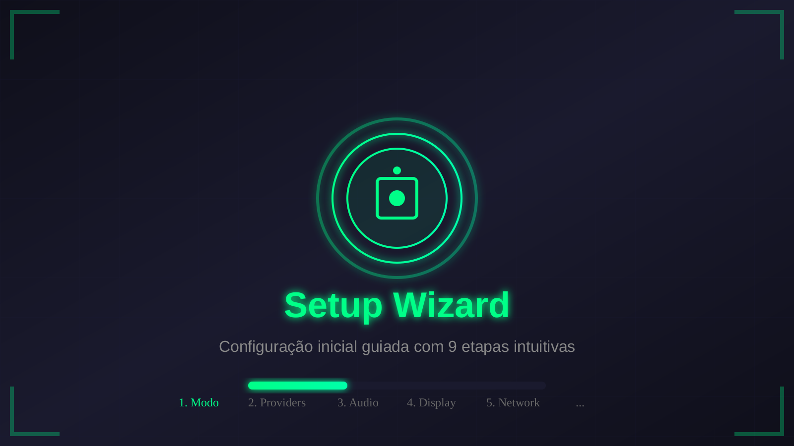

# Guia de Introdução ao TSiJUKEBOX

**Tipo:** Guia
**Público-alvo:** Novos usuários e desenvolvedores
**Versão:** 1.0.0

---

## 1. O que é o TSiJUKEBOX?

Bem-vindo ao TSiJUKEBOX, um sistema de jukebox digital de nível profissional. Ele foi projetado para ser uma solução completa e personalizável para gerenciamento e reprodução de música em diversos ambientes, desde o uso pessoal até estabelecimentos comerciais como bares e restaurantes.

### Principais Recursos:

- **Múltiplos Provedores de Música:** Integre-se perfeitamente com **Spotify**, **YouTube Music** ou use sua própria biblioteca de **arquivos locais** (MP3, FLAC, etc.).
- **Modo Kiosk:** Uma interface otimizada para telas de toque, ideal para uso público, com controles simplificados e maior durabilidade.
- **Modo Karaoke:** Transforme qualquer ambiente em um karaokê com letras sincronizadas em tela cheia.
- **Altamente Personalizável:** Desde o tema visual até as configurações de acessibilidade, tudo pode ser ajustado para atender às suas necessidades através de um assistente de configuração intuitivo.
- **Monitoramento em Tempo Real:** Um dashboard completo exibe estatísticas vitais do sistema, como uso de CPU, memória e as músicas mais populares.

---

## 2. Requisitos do Sistema

Antes de começar, certifique-se de que seu sistema atende aos seguintes requisitos:

| Componente | Mínimo | Recomendado |
| --- | --- | --- |
| **Sistema Operacional** | Linux, Windows, macOS | CachyOS / Arch Linux |
| **CPU** | 2 núcleos | 4+ núcleos |
| **RAM** | 2 GB | 4+ GB |
| **Armazenamento** | 500 MB | 2+ GB (para cache de mídia) |
| **Navegador** | Chrome 90+ | Chrome 120+ |
| **Node.js** | 18.x | 20.x LTS |

---

## 3. Instalação Rápida

Existem duas maneiras principais de colocar o TSiJUKEBOX para funcionar: desenvolvimento local ou usando Docker.

### Opção A: Desenvolvimento Local (Para Desenvolvedores)

Este método é ideal se você deseja contribuir para o projeto ou personalizar o código-fonte.

1.  **Clone o repositório:**

    ```bash
    git clone https://github.com/B0yZ4kr14/TSiJUKEBOX.git
    cd TSiJUKEBOX
    ```

2.  **Instale as dependências:**

    ```bash
    npm install
    ```

3.  **Configure as variáveis de ambiente:**
    Copie o arquivo de exemplo e edite-o se necessário.

    ```bash
    cp .env.example .env
    ```

4.  **Inicie o servidor de desenvolvimento:**

    ```bash
    npm run dev
    ```

Após esses passos, a aplicação estará disponível em **`http://localhost:5173`**.

### Opção B: Docker (Recomendado para Produção)

Usar o Docker simplifica o processo de deploy e garante que o ambiente seja consistente.

```bash
# Build e inicie os contêineres em segundo plano
docker-compose up -d
```

Alternativamente, você pode usar o Makefile para uma sintaxe mais simples:

```bash
make docker-up
```

---

## 4. Configuração Inicial (Setup Wizard)

Na primeira vez que você acessar a aplicação, será recebido pelo **Assistente de Configuração (Setup Wizard)**. Esta ferramenta guiada tornará o processo de configuração simples e rápido.

<div align="center">
  
</div>

Siga os 9 passos para personalizar:

1.  **Idioma:** Escolha entre Português, Inglês e Espanhol.
2.  **Tema:** Defina a paleta de cores da interface.
3.  **Acessibilidade:** Ajuste o contraste e o tamanho da fonte.
4.  **Conexão com Servidor:** Informe a URL do seu backend ou ative o Modo Demo para testar a UI sem um servidor.
5.  **Provedor de Música:** Selecione sua fonte de música principal (Spotify, YouTube, etc.).
6.  **Configuração do Spotify:** Insira suas credenciais da API do Spotify.
7.  **Widget de Clima:** Configure a API para exibir a previsão do tempo.
8.  **Conclusão:** Revise suas configurações e finalize o processo.

Ao final, suas preferências serão salvas e você será redirecionado para a interface principal do player.

---

## 5. Conhecendo a Interface

- **Player Principal:** A área central da tela, onde as informações da música atual e a arte do álbum são exibidas.
- **Controles de Reprodução:** Botões para play/pause, avançar/voltar, shuffle e repeat.
- **Painéis Laterais:** Acesse a fila de reprodução, o navegador do Spotify, sua biblioteca e outras configurações através dos ícones no cabeçalho ou gestos de deslizar.
- **Dashboard:** Acesse o dashboard de estatísticas para monitorar o sistema e ver as tendências de reprodução.

---

## 6. Próximos Passos

Agora que você já tem uma visão geral, aqui estão alguns recursos para aprofundar seu conhecimento:

- **[Guia do Desenvolvedor](DEVELOPER_GUIDE.md):** Se você planeja contribuir, este guia detalha a arquitetura do projeto, a estrutura de pastas e as convenções de código.
- **[Guia de Deploy](DEPLOYMENT_GUIDE.md):** Instruções detalhadas para colocar o TSiJUKEBOX em um ambiente de produção.
- **[Wiki Completa](../WIKI.md):** Explore a documentação completa de cada componente, hook e página da aplicação.
- **[Página de Ajuda](../pages/HELP_PAGE.md):** Encontre respostas para perguntas frequentes e soluções para problemas comuns.
