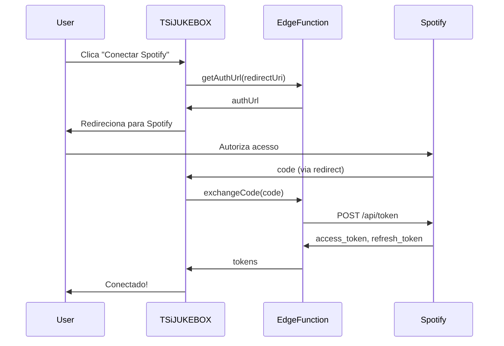

# 🔌 API de Integração Spotify

Documentação técnica completa para integração com a API do Spotify no TSiJUKEBOX.

---

## 📋 Índice

1. [Autenticação OAuth 2.0](#autenticação-oauth-20)
2. [Endpoints da API](#endpoints-da-api)
3. [Exemplos de Código](#exemplos-de-código)
4. [spotify-cli-linux](#spotify-cli-linux)
5. [Spicetify](#spicetify)
6. [Troubleshooting](#troubleshooting)

---

## 🔐 Autenticação OAuth 2.0

### Fluxo de Autorização



### Escopos Necessários

```typescript
const SPOTIFY_SCOPES = [
  'user-read-private',
  'user-read-email',
  'user-library-read',
  'user-library-modify',
  'playlist-read-private',
  'playlist-read-collaborative',
  'playlist-modify-public',
  'playlist-modify-private',
  'user-read-playback-state',
  'user-modify-playback-state',
  'user-read-currently-playing',
  'user-read-recently-played',
  'streaming'
];
```

### Exemplo: Iniciar Autenticação

```typescript
import { useSpotify } from '@/contexts/SpotifyContext';

function SpotifyConnect() {
  const { spotify, setSpotifyCredentials } = useSpotify();
  
  const handleConnect = async () => {
    // 1. Configurar credenciais
    setSpotifyCredentials(clientId, clientSecret);
    
    // 2. Obter URL de autorização
    const { data } = await supabase.functions.invoke('spotify-auth', {
      body: { 
        action: 'getAuthUrl', 
        redirectUri: window.location.origin + '/settings'
      }
    });
    
    // 3. Redirecionar para Spotify
    window.location.href = data.authUrl;
  };
  
  return <Button onClick={handleConnect}>Conectar Spotify</Button>;
}
```

---

## 🔗 Endpoints da API

### Controle de Reprodução

| Endpoint | Método | Descrição |
|----------|--------|-----------|
| `/v1/me/player/play` | PUT | Iniciar reprodução |
| `/v1/me/player/pause` | PUT | Pausar reprodução |
| `/v1/me/player/next` | POST | Próxima faixa |
| `/v1/me/player/previous` | POST | Faixa anterior |
| `/v1/me/player/seek` | PUT | Seek para posição |
| `/v1/me/player/volume` | PUT | Ajustar volume |
| `/v1/me/player/shuffle` | PUT | Toggle shuffle |
| `/v1/me/player/repeat` | PUT | Modo de repetição |

### Biblioteca do Usuário

| Endpoint | Método | Descrição |
|----------|--------|-----------|
| `/v1/me/playlists` | GET | Listar playlists |
| `/v1/me/tracks` | GET | Músicas salvas |
| `/v1/me/albums` | GET | Álbuns salvos |
| `/v1/me/following` | GET | Artistas seguidos |
| `/v1/me/player/recently-played` | GET | Histórico recente |

### Busca

```typescript
// Buscar músicas, artistas, álbuns
const results = await spotifyClient.search('Beatles', ['track', 'artist', 'album']);

// Estrutura de resposta
{
  tracks: { items: SpotifyTrack[] },
  artists: { items: SpotifyArtist[] },
  albums: { items: SpotifyAlbum[] }
}
```

---

## 💻 Exemplos de Código

### Reproduzir uma Música

```typescript
import { spotifyClient } from '@/lib/api/spotify';

// Reproduzir por URI
await spotifyClient.play({
  uris: ['spotify:track:4iV5W9uYEdYUVa79Axb7Rh']
});

// Reproduzir playlist/álbum
await spotifyClient.play({
  context_uri: 'spotify:playlist:37i9dQZF1DXcBWIGoYBM5M',
  offset: { position: 0 }
});
```

### Obter Estado de Reprodução

```typescript
const playbackState = await spotifyClient.getPlaybackState();

console.log({
  isPlaying: playbackState.is_playing,
  track: playbackState.item?.name,
  artist: playbackState.item?.artists[0]?.name,
  progress: playbackState.progress_ms,
  duration: playbackState.item?.duration_ms,
  device: playbackState.device?.name
});
```

### Gerenciar Playlists

```typescript
// Criar playlist
const playlist = await spotifyClient.createPlaylist('Minha Playlist', {
  description: 'Criada via TSiJUKEBOX',
  public: false
});

// Adicionar músicas
await spotifyClient.addTracksToPlaylist(playlist.id, [
  'spotify:track:4iV5W9uYEdYUVa79Axb7Rh',
  'spotify:track:1301WleyT98MSxVHPZCA6M'
]);

// Remover música
await spotifyClient.removeTracksFromPlaylist(playlist.id, [
  'spotify:track:4iV5W9uYEdYUVa79Axb7Rh'
]);
```

---

## 🖥️ spotify-cli-linux

O [spotify-cli-linux](https://github.com/pwittchen/spotify-cli-linux) é uma CLI que controla o Spotify via D-Bus.

### Instalação

```bash
# Via pip
pip install spotify-cli-linux

# Via instalador TSiJUKEBOX (automático)
sudo python3 install.py --mode full
```

### Comandos Disponíveis

| Comando | Descrição |
|---------|-----------|
| `spotifycli --play` | Iniciar reprodução |
| `spotifycli --pause` | Pausar reprodução |
| `spotifycli --playpause` | Alternar play/pause |
| `spotifycli --next` | Próxima música |
| `spotifycli --prev` | Música anterior |
| `spotifycli --status` | Exibir "Artista - Música" |
| `spotifycli --song` | Nome da música atual |
| `spotifycli --artist` | Artista atual |
| `spotifycli --album` | Álbum atual |
| `spotifycli --arturl` | URL da capa do álbum |
| `spotifycli --lyrics` | Buscar letra da música |
| `spotifycli --volume [0-100]` | Ajustar volume |

### Aliases TSiJUKEBOX

O instalador configura automaticamente estes aliases:

```bash
# ~/.bashrc
alias sp-play='spotifycli --play'
alias sp-pause='spotifycli --pause'
alias sp-next='spotifycli --next'
alias sp-prev='spotifycli --prev'
alias sp-status='spotifycli --status'
alias sp-lyrics='spotifycli --lyrics'
alias sp-art='spotifycli --arturl'
alias sp-song='spotifycli --song'
alias sp-artist='spotifycli --artist'
alias sp-album='spotifycli --album'
```

### Integração com Scripts

```bash
#!/bin/bash
# Exemplo: Notificação de música atual

while true; do
  SONG=$(spotifycli --song 2>/dev/null)
  ARTIST=$(spotifycli --artist 2>/dev/null)
  ART=$(spotifycli --arturl 2>/dev/null)
  
  if [ -n "$SONG" ]; then
    notify-send -i "$ART" "♫ Spotify" "$ARTIST - $SONG"
  fi
  
  sleep 30
done
```

---

## 🎨 Spicetify

O TSiJUKEBOX integra com Spicetify para personalização do Spotify.

### Instalação Automática

```bash
# O instalador configura Spicetify automaticamente
sudo python3 install.py --mode full

# Instalação manual
curl -fsSL https://raw.githubusercontent.com/spicetify/cli/main/install.sh | sh
spicetify backup apply
```

### Temas Recomendados

```bash
# Dribbblish
spicetify config current_theme Dribbblish
spicetify apply

# Marketplace (extensões)
spicetify config custom_apps marketplace
spicetify apply
```

### Extensões Úteis

- **Shuffle+**: Shuffle melhorado
- **Full App Display**: Modo tela cheia
- **Lyrics Plus**: Letras sincronizadas
- **History**: Histórico completo
- **Keyboard Shortcut**: Atalhos extras

---

## 🔧 Troubleshooting

### Erro: "Premium account required"

O Spotify Web Playback SDK requer conta Premium. Use o Spotify Desktop com spotify-cli-linux como alternativa.

### Erro: Token expirado

```typescript
// O TSiJUKEBOX faz refresh automático
// Se persistir, reconecte:
await spotifyClient.refreshAccessToken();

// Ou limpe e reconecte
clearSpotifyAuth();
```

### D-Bus não conecta (spotify-cli-linux)

```bash
# Verificar se Spotify está rodando
pgrep spotify

# Verificar D-Bus
dbus-send --print-reply \
  --dest=org.mpris.MediaPlayer2.spotify \
  /org/mpris/MediaPlayer2 \
  org.freedesktop.DBus.Properties.Get \
  string:org.mpris.MediaPlayer2.Player \
  string:PlaybackStatus
```

### Dispositivo não encontrado

```typescript
// Listar dispositivos disponíveis
const devices = await spotifyClient.getAvailableDevices();
console.log(devices);

// Transferir reprodução
await spotifyClient.transferPlayback(deviceId, true);
```

---

## 📚 Referências

- [Spotify Web API](https://developer.spotify.com/documentation/web-api)
- [Spotify Authorization Guide](https://developer.spotify.com/documentation/general/guides/authorization)
- [spotify-cli-linux GitHub](https://github.com/pwittchen/spotify-cli-linux)
- [Spicetify Docs](https://spicetify.app/docs/getting-started)

---

[← Voltar para API Reference](Dev-API-Reference.md) | [YouTube Music API →](API-YouTube-Music-Integration.md)
