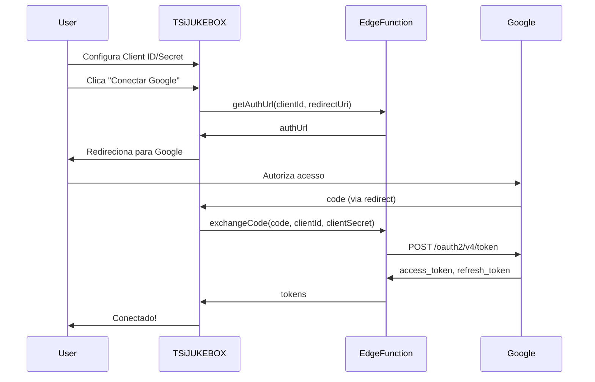

# 🔌 API de Integração YouTube Music

Documentação técnica completa para integração com a API do YouTube Music no TSiJUKEBOX.

---

## 📋 Índice

1. [Pré-requisitos](#pré-requisitos)
2. [Autenticação OAuth 2.0](#autenticação-oauth-20)
3. [Configuração de Credenciais](#configuração-de-credenciais)
4. [Endpoints da API](#endpoints-da-api)
5. [Exemplos de Código](#exemplos-de-código)
6. [Persistência de Credenciais](#persistência-de-credenciais)
7. [Troubleshooting](#troubleshooting)

---

## 📋 Pré-requisitos

### 1. Projeto no Google Cloud Console

1. Acesse [Google Cloud Console](https://console.cloud.google.com/)
2. Crie um novo projeto ou selecione existente
3. Ative a **YouTube Data API v3**
4. Configure a **tela de consentimento OAuth**

### 2. Credenciais OAuth 2.0

1. Vá em **APIs e Serviços > Credenciais**
2. Clique **Criar Credenciais > ID do cliente OAuth**
3. Tipo: **Aplicativo da Web**
4. Adicione URIs de redirecionamento:
   - `http://localhost:8080/settings`
   - `https://seu-dominio.lovable.app/settings`

### 3. Escopos Necessários

```typescript
const YOUTUBE_SCOPES = [
  'https://www.googleapis.com/auth/youtube.readonly',
  'https://www.googleapis.com/auth/youtube',
  'https://www.googleapis.com/auth/youtube.force-ssl'
];
```

---

## 🔐 Autenticação OAuth 2.0

### Fluxo de Autorização



### Estrutura de Tokens

```typescript
interface YouTubeMusicTokens {
  accessToken: string;      // Token de acesso (expira em 1h)
  refreshToken: string;     // Token para renovação
  expiresAt: number;        // Timestamp de expiração
}
```

---

## ⚙️ Configuração de Credenciais

### Via Wizard (Recomendado)

1. Vá em **Configurações > Integrações de Música > YouTube Music**
2. Clique em **Configurar com Assistente**
3. Siga os 5 passos do wizard
4. Cole o **Client ID** e **Client Secret**
5. Clique em **Conectar Google**

### Via Código

```typescript
import { useYouTubeMusic } from '@/contexts/YouTubeMusicContext';

function YouTubeMusicSetup() {
  const { setYouTubeMusicCredentials, youtubeMusic } = useYouTubeMusic();
  
  const handleSaveCredentials = () => {
    setYouTubeMusicCredentials(
      'seu-client-id.apps.googleusercontent.com',
      'seu-client-secret'
    );
  };
  
  return (
    <div>
      <Input placeholder="Client ID" onChange={...} />
      <Input placeholder="Client Secret" type="password" onChange={...} />
      <Button onClick={handleSaveCredentials}>Salvar</Button>
    </div>
  );
}
```

---

## 🔗 Endpoints da API

### Biblioteca do Usuário

| Endpoint | Método | Descrição |
|----------|--------|-----------|
| `/youtube-music/playlists` | GET | Listar playlists |
| `/youtube-music/playlists/:id/tracks` | GET | Músicas de uma playlist |
| `/youtube-music/liked` | GET | Músicas curtidas |
| `/youtube-music/recent` | GET | Reproduzidas recentemente |
| `/youtube-music/albums` | GET | Álbuns salvos |
| `/youtube-music/albums/:id/tracks` | GET | Faixas do álbum |

### Controle de Reprodução

| Endpoint | Método | Descrição |
|----------|--------|-----------|
| `/youtube-music/player/play` | POST | Iniciar reprodução |
| `/youtube-music/player/pause` | POST | Pausar reprodução |
| `/youtube-music/player/next` | POST | Próxima faixa |
| `/youtube-music/player/previous` | POST | Faixa anterior |
| `/youtube-music/player/seek` | POST | Seek para posição |
| `/youtube-music/player/volume` | POST | Ajustar volume |
| `/youtube-music/player/queue` | POST | Adicionar à fila |

### Busca

| Endpoint | Método | Descrição |
|----------|--------|-----------|
| `/youtube-music/search` | GET | Buscar músicas/álbuns/playlists |

---

## 💻 Exemplos de Código

### Iniciar Autenticação

```typescript
import { youtubeMusicClient } from '@/lib/api/youtubeMusic';
import { useYouTubeMusic } from '@/contexts/YouTubeMusicContext';

function ConnectYouTubeMusic() {
  const { youtubeMusic, setYouTubeMusicTokens } = useYouTubeMusic();
  
  const handleConnect = async () => {
    try {
      // Obter URL de autorização
      const { authUrl } = await youtubeMusicClient.getAuthUrl(
        window.location.origin + '/settings'
      );
      
      // Redirecionar para Google
      window.location.href = authUrl;
    } catch (error) {
      console.error('Erro ao iniciar autenticação:', error);
    }
  };
  
  // Tratar callback após autorização
  useEffect(() => {
    const params = new URLSearchParams(window.location.search);
    const code = params.get('code');
    
    if (code) {
      youtubeMusicClient.exchangeCode(code, window.location.origin + '/settings')
        .then(tokens => {
          setYouTubeMusicTokens(tokens);
        });
    }
  }, []);
  
  return <Button onClick={handleConnect}>Conectar Google</Button>;
}
```

### Buscar Músicas

```typescript
const searchResults = await youtubeMusicClient.search('Beatles', 'song');

console.log({
  tracks: searchResults.tracks,
  albums: searchResults.albums,
  playlists: searchResults.playlists
});
```

### Controlar Reprodução

```typescript
// Reproduzir
await youtubeMusicClient.play('dQw4w9WgXcQ'); // videoId

// Pausar
await youtubeMusicClient.pause();

// Próxima
await youtubeMusicClient.next();

// Ajustar volume (0-100)
await youtubeMusicClient.setVolume(75);

// Adicionar à fila
await youtubeMusicClient.addToQueue('videoId');
```

### Gerenciar Playlists

```typescript
// Listar playlists
const playlists = await youtubeMusicClient.getPlaylists();

// Obter músicas de uma playlist
const tracks = await youtubeMusicClient.getPlaylistTracks(playlistId);

// Criar playlist
const newPlaylist = await youtubeMusicClient.createPlaylist(
  'Minha Playlist',
  'Descrição da playlist'
);

// Adicionar música à playlist
await youtubeMusicClient.addToPlaylist(playlistId, 'videoId');

// Remover música da playlist
await youtubeMusicClient.removeFromPlaylist(playlistId, 'videoId');
```

---

## 💾 Persistência de Credenciais

O TSiJUKEBOX persiste automaticamente as credenciais no `localStorage`.

### Estrutura de Armazenamento

```typescript
// Chave: tsi_jukebox_youtube_music
interface YouTubeMusicSettings {
  clientId: string;           // Client ID do Google Cloud
  clientSecret: string;       // Client Secret do Google Cloud
  tokens: {
    accessToken: string;      // Token de acesso atual
    refreshToken: string;     // Token para renovação
    expiresAt: number;        // Timestamp de expiração
  } | null;
  user: {
    id: string;
    name: string;
    email: string;
    imageUrl: string | null;
  } | null;
  isConnected: boolean;       // Estado da conexão
}
```

### Validação Automática de Token

O contexto valida automaticamente os tokens ao carregar a aplicação:

```typescript
// YouTubeMusicContext.tsx
useEffect(() => {
  const validateSavedToken = async () => {
    if (!settings.tokens || !settings.isConnected) return;
    
    // Verificar expiração local
    if (settings.tokens.expiresAt < Date.now()) {
      // Tentar refresh
      const newTokens = await youtubeMusicClient.refreshTokens();
      setYouTubeMusicTokens(newTokens);
      return;
    }
    
    // Validar via API
    const user = await youtubeMusicClient.validateToken();
    if (!user) {
      clearYouTubeMusicAuth();
      toast.warning('Token inválido. Reconecte sua conta.');
    }
  };
  
  validateSavedToken();
}, []);
```

### Método validateToken()

```typescript
// youtubeMusic.ts
async validateToken(): Promise<YouTubeMusicUser | null> {
  if (!this.tokens?.accessToken) return null;
  
  try {
    const response = await fetch(
      'https://www.googleapis.com/youtube/v3/channels?part=snippet&mine=true',
      {
        headers: {
          'Authorization': `Bearer ${this.tokens.accessToken}`,
        },
      }
    );
    
    if (!response.ok) return null;
    
    const data = await response.json();
    // Retorna informações do usuário
    return {
      id: data.items[0].id,
      name: data.items[0].snippet.title,
      imageUrl: data.items[0].snippet.thumbnails?.default?.url
    };
  } catch {
    return null;
  }
}
```

---

## 🔧 Troubleshooting

### Erro: "Client ID não configurado"

```typescript
// Verifique se as credenciais foram salvas
const { youtubeMusic } = useYouTubeMusic();
console.log('Client ID:', youtubeMusic.clientId);
console.log('Has Secret:', !!youtubeMusic.clientSecret);

// Configure antes de conectar
setYouTubeMusicCredentials(clientId, clientSecret);
```

### Erro: "redirect_uri_mismatch"

Certifique-se de que a URI de redirecionamento no Google Cloud Console corresponde exatamente:

```
# Console do Google
https://preview--seu-projeto.lovable.app/settings

# Deve corresponder a
window.location.origin + '/settings'
```

### Token expirado frequentemente

O access token do Google expira em 1 hora. O TSiJUKEBOX faz refresh automático, mas se persistir:

```typescript
// Forçar refresh manual
const newTokens = await youtubeMusicClient.refreshTokens();
setYouTubeMusicTokens(newTokens);
```

### Erro 403: "Access Not Configured"

1. Verifique se a **YouTube Data API v3** está ativada
2. Verifique os escopos na tela de consentimento
3. Se usando conta de teste, adicione seu email em **OAuth consent screen > Test users**

### Quota excedida

A YouTube Data API tem limites de quota. Monitore no Google Cloud Console:

```
APIs & Services > YouTube Data API v3 > Quotas
```

---

## 📚 Referências

- [YouTube Data API v3](https://developers.google.com/youtube/v3)
- [Google OAuth 2.0](https://developers.google.com/identity/protocols/oauth2)
- [YouTube Music API (não oficial)](https://ytmusicapi.readthedocs.io/)
- [TSiJUKEBOX Wiki](Home.md)

---

[← Spotify API](API-Spotify-Integration.md) | [Voltar para API Reference](Dev-API-Reference.md)
