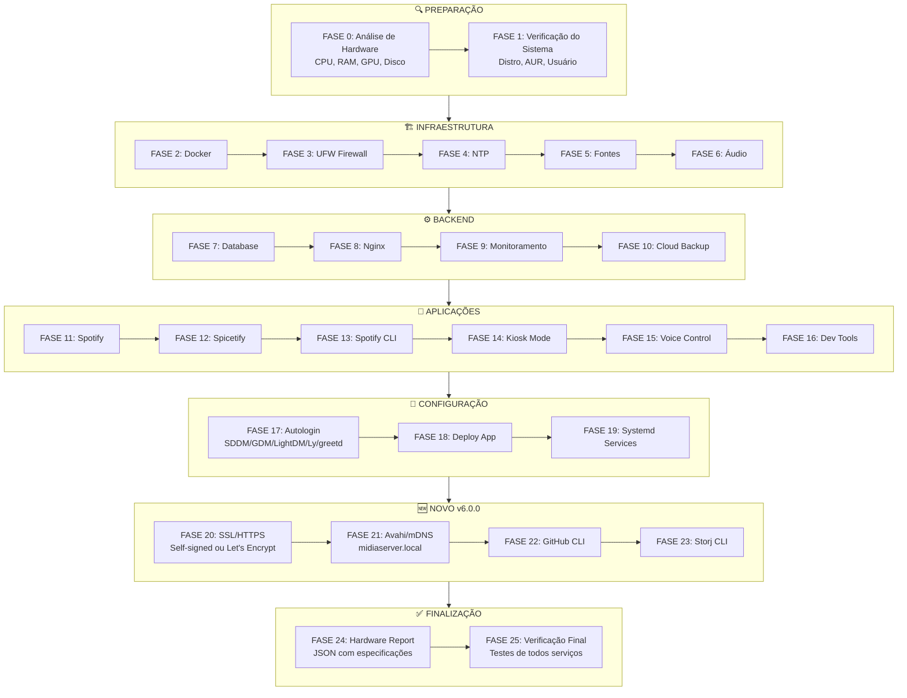
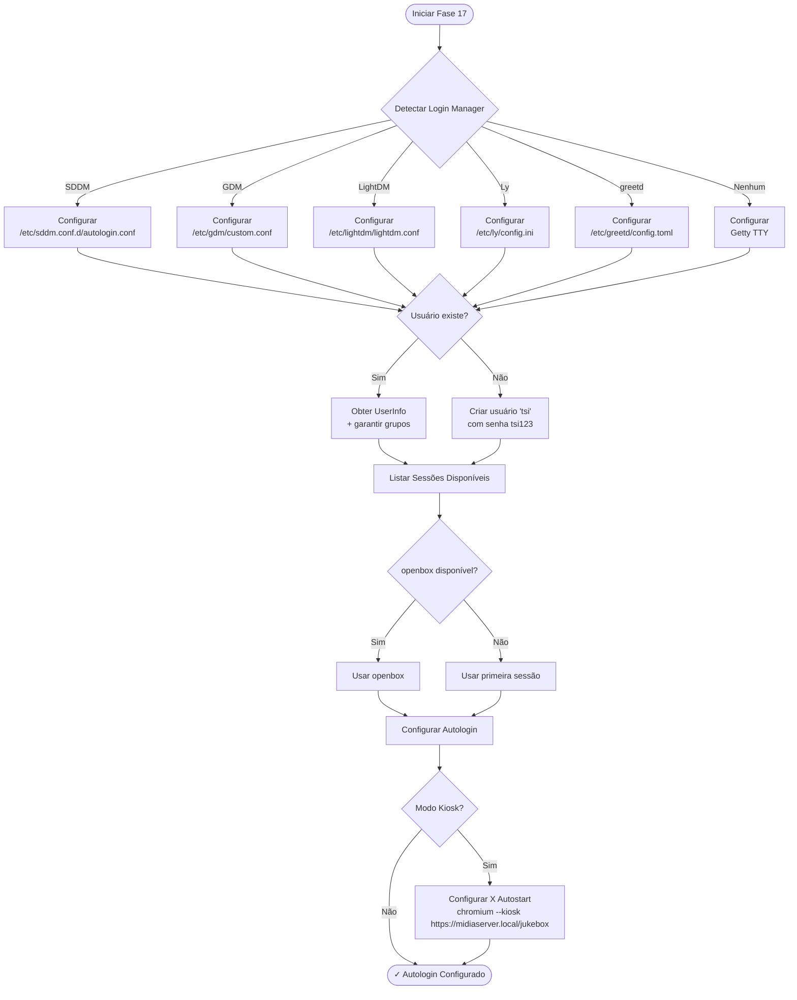
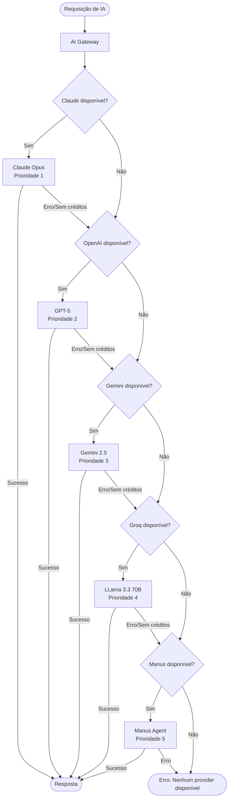
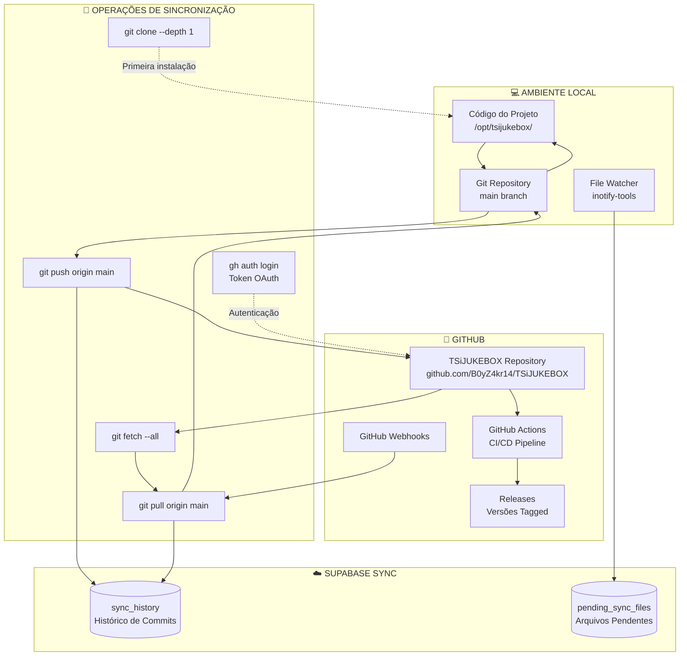
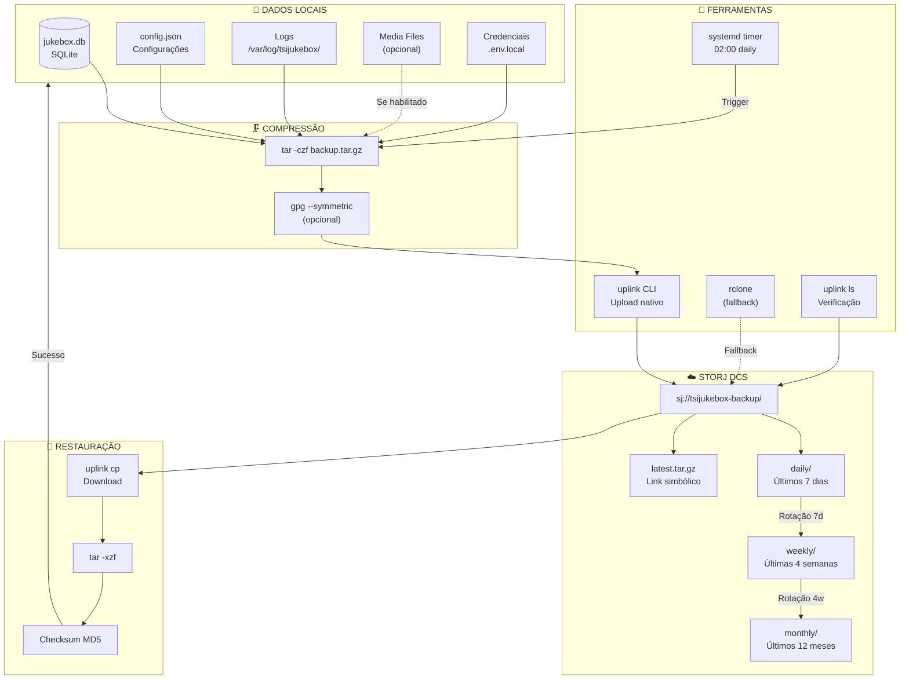
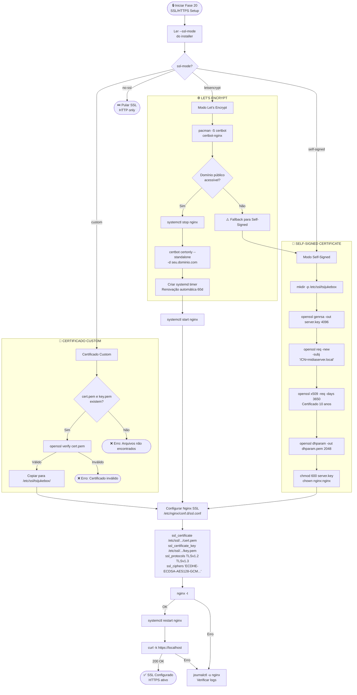

# 📋 TSiJUKEBOX Installer v6.0.0 - Referência Completa

> Documentação técnica completa do instalador unificado v6.0.0 com todas as 26 fases.

---

## 📊 Visão Geral

O **TSiJUKEBOX Unified Installer v6.0.0** é um instalador Python completo que automatiza a configuração de um sistema de jukebox enterprise em distribuições baseadas em Arch Linux.

### Características Principais

| Feature | Descrição |
|---------|-----------|
| **26 Fases** | Instalação modular e completa |
| **Análise de Hardware** | Detecta CPU, RAM, GPU automaticamente |
| **SSL/HTTPS** | Certificados self-signed ou Let's Encrypt |
| **Avahi/mDNS** | Acesso via `midiaserver.local` |
| **Autologin Inteligente** | Detecta SDDM/GDM/LightDM/Ly/greetd |
| **Analytics** | Telemetria opcional para melhorias |

---

## 🔧 Instalação Rápida

```bash
# Instalação padrão (modo full)
curl -fsSL https://raw.githubusercontent.com/B0yZ4kr14/TSiJUKEBOX/main/scripts/unified-installer.py | sudo python3

# Com modo específico
curl -fsSL ... | sudo python3 - --mode kiosk

# Instalação automática
curl -fsSL ... | sudo python3 - --auto
```

---

## 📋 As 26 Fases de Instalação

### Diagrama de Fluxo



### Diagrama do Sistema de Autologin (Fase 17)



### Diagrama do Sistema de Fallback de IA



---

## Diagramas de Fluxo Adicionais

### Fluxo de Sincronização GitHub



### Sistema de Backup Storj



### SSL Setup (Fase 20)



### Avahi/mDNS Configuration (Fase 21)

```mermaid
flowchart TD
    Start(["📡 Iniciar Fase 21<br/>Avahi/mDNS Setup"]) --> InstallPkgs["pacman -S avahi nss-mdns"]
    
    InstallPkgs --> ConfigHostname["Configurar hostname"]
    
    subgraph HOSTNAME["🏷️ CONFIGURAÇÃO DO HOSTNAME"]
        ConfigHostname --> SetHostname["hostnamectl set-hostname midiaserver"]
        SetHostname --> EditHosts["Editar /etc/hosts<br/>127.0.0.1 midiaserver midiaserver.local"]
        EditHosts --> EditHostsFile["/etc/hostname<br/>midiaserver"]
    end
    
    EditHostsFile --> ConfigNSS["Configurar NSSwitch"]
    
    subgraph NSS["🔧 NSSwitch CONFIG"]
        ConfigNSS --> BackupNSS["cp /etc/nsswitch.conf /etc/nsswitch.conf.bak"]
        BackupNSS --> EditNSS["Editar /etc/nsswitch.conf"]
        EditNSS --> NSSLine["hosts: mymachines mdns_minimal [NOTFOUND=return] resolve [!UNAVAIL=return] files myhostname dns"]
    end
    
    NSSLine --> CreateServices["Criar serviços Avahi"]
    
    subgraph SERVICES["📋 SERVIÇOS mDNS"]
        CreateServices --> SvcDir["mkdir -p /etc/avahi/services"]
        
        SvcDir --> SvcHTTPS["tsijukebox-https.service<br/>_https._tcp port 443"]
        SvcDir --> SvcHTTP["tsijukebox-http.service<br/>_http._tcp port 80"]
        SvcDir --> SvcGrafana["grafana.service<br/>_http._tcp port 3000"]
        SvcDir --> SvcPrometheus["prometheus.service<br/>_http._tcp port 9090"]
        SvcDir --> SvcSSH["ssh.service<br/>_ssh._tcp port 22"]
        SvcDir --> SvcAPI["api.service<br/>_http._tcp port 8080"]
    end
    
    SvcHTTPS --> EnableAvahi
    SvcHTTP --> EnableAvahi
    SvcGrafana --> EnableAvahi
    SvcPrometheus --> EnableAvahi
    SvcSSH --> EnableAvahi
    SvcAPI --> EnableAvahi
    
    EnableAvahi["systemctl enable --now avahi-daemon"]
    EnableAvahi --> WaitStart["sleep 3<br/>Aguardar inicialização"]
    
    WaitStart --> TestLocal["Testar resolução local"]
    
    subgraph TEST["🧪 VERIFICAÇÃO"]
        TestLocal --> Ping["ping -c 1 midiaserver.local"]
        Ping -->|"Sucesso"| Browse["avahi-browse -a -t"]
        Ping -->|"Falha"| Debug["Verificar logs"]
        
        Browse --> ListServices["Listar serviços descobertos"]
        ListServices --> Resolve["avahi-resolve -n midiaserver.local"]
        
        Debug --> CheckDaemon["systemctl status avahi-daemon"]
        CheckDaemon --> CheckLogs["journalctl -u avahi-daemon -n 50"]
        CheckLogs --> CheckFirewall["Verificar portas 5353/udp"]
    end
    
    Resolve -->|"IP retornado"| Done(["✅ mDNS Configurado<br/>midiaserver.local ativo"])
    CheckFirewall --> FixFirewall["ufw allow 5353/udp"]
    FixFirewall --> EnableAvahi

### Detalhamento das Fases

#### FASE 0: Análise de Hardware
```python
def _phase_hardware_analysis(self) -> bool:
    """Analisa hardware e sugere configuração ideal."""
```

| Detecção | Método |
|----------|--------|
| CPU | `/proc/cpuinfo`, `lscpu` |
| RAM | `/proc/meminfo` |
| GPU | `lspci`, `nvidia-smi` |
| Disco | `df`, `lsblk` |

**Saída:**
- Recomendação de modo (full/kiosk/server/minimal)
- Sugestão de database (SQLite/MariaDB/PostgreSQL)
- Alertas de hardware insuficiente

---

#### FASE 1: Verificação do Sistema
```python
def _phase_system_check(self) -> bool:
    """Verifica compatibilidade do sistema."""
```

| Verificação | Critério |
|-------------|----------|
| Distro | Arch-based (arch, cachyos, manjaro, endeavouros) |
| AUR Helper | paru, yay, ou pacman |
| Usuário | SUDO_USER ou usuário atual |
| Disco livre | Mínimo 500MB |
| Rede | Conectividade com internet |

---

#### FASE 2: Docker
```python
def _phase_docker(self) -> bool:
    """Instala e configura Docker + Docker Compose."""
```

**Pacotes instalados:**
- `docker`
- `docker-compose`

**Configuração:**
- Adiciona usuário ao grupo `docker`
- Habilita `docker.service`
- Configura daemon.json

---

#### FASE 3: UFW Firewall
```python
def _phase_ufw(self) -> bool:
    """Configura firewall UFW."""
```

**Regras configuradas:**

| Porta | Protocolo | Serviço |
|-------|-----------|---------|
| 22 | TCP | SSH |
| 80 | TCP | HTTP (redirect) |
| 443 | TCP | HTTPS |
| 3000 | TCP | Grafana |
| 5173 | TCP | TSiJUKEBOX |
| 5353 | UDP | mDNS |
| 9090 | TCP | Prometheus (local) |
| 9100 | TCP | Node Exporter (local) |

---

#### FASE 4: NTP
```python
def _phase_ntp(self) -> bool:
    """Configura sincronização de tempo."""
```

**Métodos:**
1. `systemd-timesyncd` (padrão)
2. `chrony` (fallback)

---

#### FASE 5: Fontes
```python
def _phase_fonts(self) -> bool:
    """Instala fontes do sistema."""
```

**Fontes instaladas:**
- `noto-fonts`
- `noto-fonts-emoji`
- `ttf-dejavu`
- `ttf-liberation`

---

#### FASE 6: Áudio
```python
def _phase_audio(self) -> bool:
    """Configura sistema de áudio."""
```

**Opções:**
1. PipeWire (recomendado)
2. PulseAudio (fallback)

---

#### FASE 7: Database
```python
def _phase_database(self) -> bool:
    """Configura banco de dados."""
```

| Tipo | Recomendado Para |
|------|------------------|
| SQLite | < 4GB RAM, uso pessoal |
| MariaDB | 4-8GB RAM, pequenas empresas |
| PostgreSQL | > 8GB RAM, enterprise |

---

#### FASE 8: Nginx
```python
def _phase_nginx(self) -> bool:
    """Configura Nginx como proxy reverso."""
```

**Configuração:**
```nginx
server {
    listen 443 ssl http2;
    server_name midiaserver.local;
    
    ssl_certificate /etc/nginx/ssl/midiaserver.local.crt;
    ssl_certificate_key /etc/nginx/ssl/midiaserver.local.key;
    
    location / {
        proxy_pass http://127.0.0.1:5173;
    }
    
    location /grafana/ {
        proxy_pass http://127.0.0.1:3000/;
    }
    
    location /prometheus/ {
        proxy_pass http://127.0.0.1:9090/;
    }
}
```

---

#### FASE 9: Monitoramento
```python
def _phase_monitoring(self) -> bool:
    """Instala Grafana + Prometheus."""
```

**Componentes:**
- Grafana 10.x
- Prometheus 2.x
- Node Exporter

---

#### FASE 10: Cloud Backup
```python
def _phase_cloud_backup(self) -> bool:
    """Configura backup na nuvem."""
```

**Providers suportados:**
- Storj (recomendado)
- Google Drive (via rclone)
- AWS S3

---

#### FASE 11: Spotify
```python
def _phase_spotify(self) -> bool:
    """Instala Spotify."""
```

**Método:**
- `spotify-launcher` (AUR)

---

#### FASE 12: Spicetify
```python
def _phase_spicetify(self) -> bool:
    """Configura Spicetify."""
```

**Temas instalados:**
- Dribbblish
- Catppuccin
- Nord

---

#### FASE 13: Spotify CLI
```python
def _phase_spotify_cli(self) -> bool:
    """Instala spotify-cli-linux."""
```

**Comandos disponíveis:**
```bash
sp-play, sp-pause, sp-next, sp-prev, sp-status, sp-song, sp-artist, sp-album
```

---

#### FASE 14: Kiosk
```python
def _phase_kiosk(self) -> bool:
    """Configura modo kiosk."""
```

**Componentes:**
- Chromium (--kiosk mode)
- Openbox
- X autostart

---

#### FASE 15: Voice Control
```python
def _phase_voice_control(self) -> bool:
    """Configura controle por voz."""
```

**Tecnologias:**
- Vosk (speech recognition)
- Wake word detection

---

#### FASE 16: Dev Tools
```python
def _phase_devtools(self) -> bool:
    """Instala ferramentas de desenvolvimento."""
```

**Ferramentas:**
- Node.js 20+
- Python 3.11+
- Git
- Base-devel

---

#### FASE 17: Autologin (APRIMORADO v6.0.0)
```python
def _phase_autologin(self) -> bool:
    """Configura autologin com detecção automática."""
```

**Login Managers Suportados:**

| Manager | Arquivo de Configuração |
|---------|------------------------|
| SDDM | `/etc/sddm.conf.d/autologin.conf` |
| GDM | `/etc/gdm/custom.conf` |
| LightDM | `/etc/lightdm/lightdm.conf` |
| Ly | `/etc/ly/config.ini` |
| greetd | `/etc/greetd/config.toml` |
| Getty | `/etc/systemd/system/getty@tty1.service.d/override.conf` |

**Fluxo de Detecção:**
```
Detectar Login Manager
       │
       ├──► SDDM/GDM/LightDM/Ly/greetd encontrado
       │         │
       │         ▼
       │    Detectar/Criar usuário
       │         │
       │         ▼
       │    Listar sessões disponíveis
       │         │
       │         ▼
       │    Configurar autologin
       │         │
       │         ▼
       │    (Modo Kiosk?) ──► Configurar X Autostart
       │                       chromium --kiosk https://midiaserver.local/jukebox
       │
       └──► Nenhum encontrado ──► Usar Getty TTY
```

---

#### FASE 18: Deploy
```python
def _phase_deploy(self) -> bool:
    """Faz deploy da aplicação via Docker."""
```

---

#### FASE 19: Systemd
```python
def _phase_systemd(self) -> bool:
    """Configura serviços systemd."""
```

**Serviços criados:**
- `tsijukebox.service`
- `tsijukebox-watcher.service`

---

#### FASE 20: SSL Setup (NOVO v6.0.0)
```python
def _phase_ssl_setup(self) -> bool:
    """Configura certificados SSL."""
```

**Modos:**

| Modo | Descrição |
|------|-----------|
| `self-signed` | Gera certificado local para midiaserver.local |
| `letsencrypt` | Obtém certificado válido via Certbot |

**Arquivos gerados:**
```
/etc/nginx/ssl/
├── midiaserver.local.crt
├── midiaserver.local.key
└── dhparam.pem
```

---

#### FASE 21: Avahi/mDNS (NOVO v6.0.0)
```python
def _phase_avahi_mdns(self) -> bool:
    """Configura descoberta de rede via mDNS."""
```

**Configuração:**
- Hostname: `midiaserver`
- Domínio: `.local`
- Serviços: HTTP, Grafana, Prometheus, SSH

**Arquivos criados:**
```
/etc/avahi/services/
├── tsijukebox.service
├── grafana.service
├── prometheus.service
└── ssh.service
```

---

#### FASE 22: GitHub CLI (NOVO v6.0.0)
```python
def _phase_github_cli(self) -> bool:
    """Instala GitHub CLI."""
```

**Pacote:** `github-cli`

---

#### FASE 23: Storj CLI (NOVO v6.0.0)
```python
def _phase_storj_full(self) -> bool:
    """Instala Storj Uplink CLI completo."""
```

**Comandos:**
```bash
uplink ls sj://bucket
uplink cp file.txt sj://bucket/
uplink share sj://bucket/file.txt
```

---

#### FASE 24: Hardware Report (NOVO v6.0.0)
```python
def _phase_hardware_report(self) -> bool:
    """Gera relatório JSON de hardware."""
```

**Arquivo:** `/var/log/tsijukebox/hardware.json`

**Conteúdo:**
```json
{
  "timestamp": "2024-12-23T10:30:00Z",
  "cpu": {
    "model": "AMD Ryzen 7 5800X",
    "cores": 8,
    "threads": 16
  },
  "memory": {
    "total_gb": 32,
    "available_gb": 28
  },
  "gpu": {
    "vendor": "NVIDIA",
    "model": "RTX 3080"
  },
  "storage": {
    "total_gb": 500,
    "free_gb": 420
  }
}
```

---

#### FASE 25: Verificação Final (NOVO v6.0.0)
```python
def _phase_verify(self) -> bool:
    """Executa verificação final de todos os componentes."""
```

**Verificações:**
- Serviços systemd ativos
- Portas abertas
- Certificado SSL válido
- Avahi respondendo
- Docker containers rodando

---

## 🔧 Opções de Linha de Comando

### Opções Gerais

| Flag | Tipo | Descrição | Padrão |
|------|------|-----------|--------|
| `--mode` | string | Modo de instalação | `full` |
| `--user` | string | Usuário do sistema | `$SUDO_USER` |
| `--timezone` | string | Timezone | `America/Sao_Paulo` |
| `--install-dir` | path | Diretório de instalação | `/opt/tsijukebox` |
| `--auto`, `-y` | flag | Sem confirmações | `false` |
| `--dry-run` | flag | Simular sem executar | `false` |
| `--verbose`, `-v` | flag | Output detalhado | `false` |
| `--quiet`, `-q` | flag | Modo silencioso | `false` |

### Opções SSL

| Flag | Tipo | Descrição | Padrão |
|------|------|-----------|--------|
| `--ssl-mode` | string | `self-signed` ou `letsencrypt` | `self-signed` |
| `--ssl-domain` | string | Domínio para certificado | `midiaserver.local` |
| `--ssl-email` | string | Email para Let's Encrypt | - |
| `--no-ssl` | flag | Não configurar SSL | `false` |

### Opções Avahi

| Flag | Tipo | Descrição | Padrão |
|------|------|-----------|--------|
| `--avahi-hostname` | string | Hostname mDNS | `midiaserver` |
| `--no-avahi` | flag | Não configurar Avahi | `false` |

### Opções de Componentes

| Flag | Descrição |
|------|-----------|
| `--no-docker` | Não instalar Docker |
| `--no-ufw` | Não configurar UFW |
| `--no-ntp` | Não configurar NTP |
| `--no-nginx` | Não instalar Nginx |
| `--no-monitoring` | Não instalar Grafana/Prometheus |
| `--no-spotify` | Não instalar Spotify |
| `--no-spicetify` | Não instalar Spicetify |
| `--no-spotify-cli` | Não instalar spotify-cli |
| `--no-autologin` | Não configurar autologin |
| `--no-github-cli` | Não instalar GitHub CLI |
| `--no-storj` | Não instalar Storj CLI |

---

## 📁 Estrutura de Arquivos

Após a instalação:

```
/opt/tsijukebox/
├── docker-compose.yml
├── .env
├── app/
├── data/
└── logs/

/etc/tsijukebox/
├── config.json
├── nginx.conf
└── nginx-ssl.conf

/etc/nginx/ssl/
├── midiaserver.local.crt
├── midiaserver.local.key
└── dhparam.pem

/etc/avahi/services/
├── tsijukebox.service
├── grafana.service
├── prometheus.service
└── ssh.service

/var/lib/tsijukebox/
├── jukebox.db
└── backups/

/var/log/tsijukebox/
├── install.log
├── hardware.json
└── app.log
```

---

## 🔍 Exemplos de Uso

### Instalação Completa Automática
```bash
curl -fsSL .../unified-installer.py | sudo python3 - --auto
```

### Modo Kiosk com Let's Encrypt
```bash
curl -fsSL .../unified-installer.py | sudo python3 - \
  --mode kiosk \
  --ssl-mode letsencrypt \
  --ssl-domain meudominio.com \
  --ssl-email admin@meudominio.com
```

### Servidor Headless Mínimo
```bash
curl -fsSL .../unified-installer.py | sudo python3 - \
  --mode server \
  --no-spotify \
  --no-monitoring \
  --no-autologin
```

### Simulação (Dry Run)
```bash
curl -fsSL .../unified-installer.py | sudo python3 - --dry-run --verbose
```

### Hostname Customizado
```bash
curl -fsSL .../unified-installer.py | sudo python3 - \
  --avahi-hostname myjukebox
```

---

## 🐛 Troubleshooting

### Verificar Logs
```bash
# Log de instalação
cat /var/log/tsijukebox-install.log

# Log da aplicação
journalctl -u tsijukebox -f
```

### Verificar Serviços
```bash
systemctl status tsijukebox docker nginx grafana prometheus avahi-daemon
```

### Verificar SSL
```bash
openssl s_client -connect midiaserver.local:443 -servername midiaserver.local
```

### Verificar mDNS
```bash
avahi-browse -a
ping midiaserver.local
```

### Regenerar SSL
```bash
sudo tsijukebox --regenerate-ssl
```

---

## 📚 Links Relacionados

- [Instalação Rápida](Install-OneCommand.md)
- [Instalação CachyOS](Install-CachyOS.md)
- [Setup Openbox Kiosk](Openbox-Kiosk-Setup.md)
- [Deploy em Produção](../PRODUCTION-DEPLOY.md)

---

*TSiJUKEBOX Installer v6.0.0 - Dedicated to the Public Domain*
